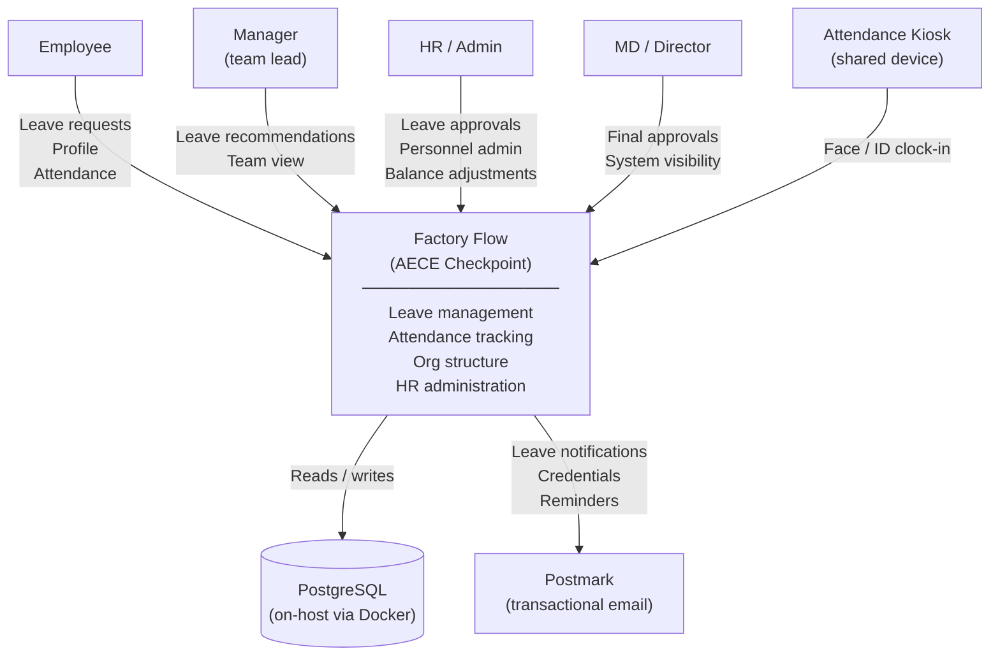

# 01 — System Overview

## What It Is

**Factory Flow** (branded as **AECE Checkpoint**) is a self-hosted workforce management system for small-to-medium South African organisations. It manages:

- **Leave** — request, approval, accrual, and BCEA statutory compliance
- **Attendance** — clock-in/out via face recognition or ID, infringement tracking
- **Org structure** — position hierarchy, departments, reporting lines
- **HR administration** — grievances, contract history, payroll company assignments
- **Configuration** — branding, employee types, custom leave rules, public holidays

The system is a single deployable unit: one Docker container serves both the React SPA and the Express API from port 5000.

---

## Users and Roles

Users hold one or more roles from the set `['employee', 'manager', 'hr', 'md', 'admin']`. Roles are additive — no implicit inheritance. The `admin` role implicitly satisfies any role requirement.

| Role | Who | What they can do |
|------|-----|-----------------|
| **employee** | Standard staff | Submit leave, view own balances, clock in/out, view org chart, submit grievances, edit own profile |
| **manager** | Team leads | Everything an employee can do + recommend/action leave requests for their reports, view team attendance |
| **hr** | HR staff | Full leave workflow management, grievance handling, personnel admin, leave rule configuration, manual balance adjustments |
| **md** | Managing Director | Final leave approval, full system visibility |
| **admin** | System owners | Full access: settings, audit logs, database backup, user management — implicitly satisfies all other roles |

A single user can hold multiple roles simultaneously (e.g. `['employee', 'manager']`). All authentication uses **email + password** (bcrypt). The attendance kiosk uses **face recognition or employee ID** — no session required.

---

## System Context (C4 Level 1)



---

## Tech Stack

### Backend
| Concern | Technology |
|---------|-----------|
| Runtime | Node.js 20 |
| Framework | Express 4.21 |
| Language | TypeScript 5.6 |
| Database ORM | Drizzle ORM 0.39 |
| Database | PostgreSQL 16 |
| Session store | connect-pg-simple (PostgreSQL-backed sessions) |
| Auth | Express-session + bcrypt |
| Validation | Zod |
| Email | Postmark API |
| Face recognition | @vladmandic/face-api (TensorFlow.js, 128-dim embeddings) |
| Excel I/O | xlsx |

### Frontend
| Concern | Technology |
|---------|-----------|
| Framework | React 19 |
| Build tool | Vite 7 |
| Router | Wouter |
| Server state | TanStack React Query 5 |
| Forms | React Hook Form + Zod |
| UI primitives | Radix UI |
| Styling | Tailwind CSS 4 |
| Charts | Recharts |
| Animations | Framer Motion |
| PDF export | jsPDF |
| Date utilities | date-fns |

### Infrastructure
| Concern | Technology |
|---------|-----------|
| Containerisation | Docker (multi-stage, Node 20 Alpine) |
| Orchestration | Docker Compose |
| DB backup | Every 6 hours pg_dump, gzipped, 90-day retention |
| Proxy | Nginx or any reverse proxy (TRUST_PROXY env var) |

---

## What It Is Not

- **Not a payroll processor** — it tracks which payroll company an employee belongs to but does not calculate or disburse pay.
- **Not a cloud SaaS** — designed for self-hosted on-premise or single-VPS deployment; no multi-tenant isolation.
- **Not a time-tracking tool** — attendance is clock-in/clock-out only; there is no project or task time tracking.

---

## Repository Structure

```
Factory Flow/
├── client/           # React SPA (Vite)
│   └── src/
│       ├── pages/        # Route-level page components
│       │   └── admin/    # Role-gated dashboard sections
│       ├── components/   # Reusable UI components
│       ├── lib/          # API client, auth context, utilities
│       └── hooks/        # Custom React hooks
├── server/           # Express API
│   ├── index.ts          # Server setup, startup & scheduled jobs
│   ├── routes.ts         # All API route handlers (~4200 lines)
│   ├── storage.ts        # DrizzleStorage class (database abstraction)
│   ├── bcea.ts           # Pure BCEA leave calculation logic (no DB access)
│   ├── leave-accrual.ts  # Accrual engine orchestration & termination settlement
│   ├── custom-leave-rules.ts  # Custom leave accrual engine
│   └── email.ts          # Postmark email templates
├── shared/           # Shared between client and server
│   └── schema.ts         # Drizzle table definitions + Zod validators
├── migrations/       # Drizzle database migrations (SQL)
├── specs/            # Implementation specifications
├── Dockerfile
├── docker-compose.yml
└── docker-entrypoint.sh  # Startup sequence (migrate → create unmanaged tables → start)
```

See [02 — Backend Architecture](02-backend-architecture.md) and [03 — Frontend Architecture](03-frontend-architecture.md) for detail on each layer.
