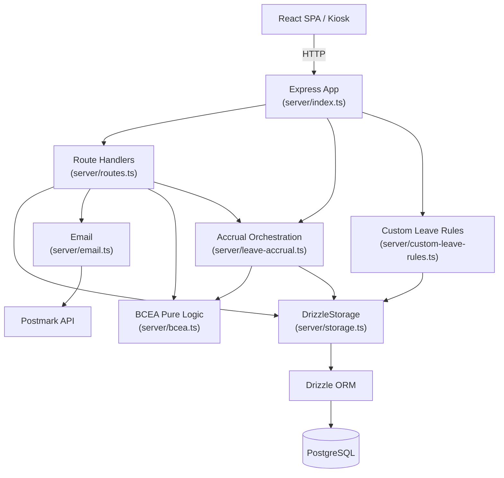

# 02 — Backend Architecture

## Overview

The backend is an **Express 4 application written in TypeScript**, running on Node.js 20. It serves the React SPA as static files and exposes a REST API under `/api`. All persistent state lives in PostgreSQL via Drizzle ORM. There is no microservices split — the entire backend is one process.

---

## Layers



---

## Entry Point (`server/index.ts`)

Responsibilities on startup:

1. Configure Express middleware (JSON body parser, session)
2. Register all routes from `routes.ts`
3. Mount static file serving for the built React SPA
4. Start HTTP server on `PORT` (default `5000`)
5. Schedule background jobs

**Session setup:**
```typescript
app.use(session({
  store: new PgSession({ pool }),      // Sessions persisted in PostgreSQL
  secret: process.env.SESSION_SECRET,
  resave: false,
  saveUninitialized: false,
  cookie: {
    maxAge: 8 * 60 * 60 * 1000,       // 8-hour session lifetime
    httpOnly: true,
    secure: process.env.NODE_ENV === 'production' && process.env.TRUST_PROXY === 'true'
  }
}));
```

**Scheduled jobs:**

| Job | Schedule | Purpose |
|-----|----------|---------|
| Custom leave rules | On startup | Evaluate `leaveRules` against all employees and update balances |
| Escalation reminders | Every 8 hours | Email approvers for leave requests pending > 3 days |
| Monthly accrual run | 1st of each month (daily check) | Credit prior month's leave for all eligible employees; settle past approved requests |

> **Prior-month semantics:** The accrual run fires on the 1st of the month and credits leave earned in the *previous* calendar month. The run for March service executes on 1 April. See [05 — Leave Domain](05-leave-domain.md) for full detail.

---

## Authentication (`server/routes.ts`)

Three authentication paths exist, all using Express-session with bcrypt password hashing:

| Path | Endpoint | Mechanism |
|------|----------|-----------|
| Standard | `POST /api/auth/login` | Email + bcrypt password check |
| Manager-approved | `POST /api/auth/manager-approved-login` | Email + password, for manager-level access |
| Biometric | `POST /api/auth/login-by-face` | Face descriptor Euclidean distance against stored embeddings |

### Face authentication detail
The kiosk sends a 128-dimensional face embedding from the browser (computed by `@vladmandic/face-api`). The server fetches all stored descriptors from the `faceDescriptors` table, computes Euclidean distance for each, and returns the matching user if distance is below a configured threshold. No session is created for kiosk face auth — attendance records are written directly.

### Public routes (no session required)
These routes bypass the `requireAuth` middleware:
- `GET /api/users/face-descriptors` — face models needed by kiosk on page load
- `GET /api/users/kiosk` / `GET /api/users/kiosk-lookup/:id` — kiosk tile mode
- `POST /api/attendance` — clock-in/out for kiosk
- `GET /api/attendance/status/:userId` — clock-in status check for kiosk display
- `GET /api/departments` — department list (used on public forms)
- `GET /api/settings/:key` — settings including branding loaded before login
- All `/api/auth/*` routes

### Authorization middleware

```typescript
function requireAuth(req, res, next) { ... }              // Any authenticated user
function requireRole(...roles)(req, res, next) { ... }    // Must hold at least one of the given roles
function requireAdmin(req, res, next) { ... }             // admin or hr
function requireAdminOnly(req, res, next) { ... }         // admin role only
```

The `admin` role implicitly satisfies any `requireRole` check. Users can hold multiple roles simultaneously — `requireRole('manager', 'hr')` passes if the user has either role.

---

## Route Structure (`server/routes.ts`)

All routes are registered on a single Express `Router`. The file is ~4200 lines and covers:

| Domain | Prefix | Auth required |
|--------|--------|---------------|
| Auth | `/api/auth` | Partial (see above) |
| Users | `/api/users` | Yes (kiosk endpoints public) |
| Leave balances | `/api/leave-balances` | Yes |
| Leave requests | `/api/leave-requests` | Yes |
| Attendance | `/api/attendance` | Partial (kiosk routes public) |
| Departments | `/api/departments` | Public GET, admin write |
| User groups | `/api/user-groups` | Admin |
| Employee types | `/api/employee-types` | Admin |
| Leave rules | `/api/leave-rules` | Admin |
| Public holidays | `/api/public-holidays` | Admin |
| Companies | `/api/companies` | Admin |
| Org positions | `/api/org-positions` | Admin |
| Grievances | `/api/grievances` | Yes |
| Notifications | `/api/notifications` | Yes |
| Settings | `/api/settings` | Public GET, admin write |
| Audit logs | `/api/audit-logs` | Admin |
| Reports | `/api/reports` | HR / Admin |
| Backup | `/api/backup` | Admin |
| Dashboard | `/api/dashboard` | Yes |
| External API | `/api/external` | API key |

---

## Storage Layer (`server/storage.ts`)

All database access is routed through a `DrizzleStorage` class exported as a singleton `storage` object. Routes never import Drizzle directly — they call typed methods such as `storage.getUser(id)`, `storage.createLeaveRequest(data)`.

The interface also exposes methods for the new accrual tables:
- `getAllAccrualRateTiers()` / `createAccrualRateTier()` / `updateAccrualRateTier()` / `deleteAccrualRateTier()`
- `getSickLeaveTracking(userId)` / `upsertSickLeaveTracking()` / `updateSickLeaveTracking()`
- `getLeaveAccrualRecord(employeeId, leaveType, period, eventType)` / `createLeaveAccrualRecord()`

---

## Business Logic Modules

### `server/bcea.ts` — Pure BCEA Calculations (no DB access)

A pure-logic module: all functions take data as arguments and return computed values. No database calls. Implements the South African BCEA leave entitlement formulas per the leave accrual spec v1.3:

| Function | Purpose |
|----------|---------|
| `determineAccrualRate(months, overrideDays, tiers)` | Returns the employee's monthly accrual rate. Per-employee override takes priority over tier lookup. |
| `calculateActiveDays(year, month, startDate, deactivationDate, pausingDays)` | Returns calendar days employed minus accrual-pausing leave days — the numerator in the pro-ration formula. |
| `calculateAnnualLeaveAccrual(rate, activeDays, totalDays)` | Applies `rate × (activeDays / totalDays)` with no rounding. |
| `calculateGraduatedSickCredit(cumulative, daysWorked, credited)` | Calculates new sick day credits under the 1-per-26-days-worked rule. |
| `calculateSickLeaveTransitionBalance(workDaysPerWeek, sickTaken)` | Full entitlement minus days *taken* (not accrued) at the 6-month transition. |
| `sickLeaveFullEntitlement(workDaysPerWeek)` | `30 × (workDays / 5)` — scales for part-time workers. |
| `completedMonths(startDate, referenceDate)` | Full calendar months employed. |
| `isFrlEligible(startDate, workDaysPerWeek, referenceDate)` | Returns true if ≥ 4 months employed AND `workDaysPerWeek >= 4`. |
| `scheduledWorkingDaysInMonth(year, month, workDaysPerWeek)` | Used for sick leave graduated accrual. |
| `getCarryOverExpiryDate(cycleEndDate, graceMonths)` | Returns carry-over expiry date (default: 6 months after cycle end). |
| `ACCRUAL_PAUSING_LEAVE_TYPES` | Constant set of leave types that pause annual leave accrual: Unpaid, Maternity, Parental, Adoption, Commissioning. |
| `STATUTORY_LEAVE_ENTITLEMENTS` | Fixed event-leave allocations: Maternity (87 days), Parental (10), Adoption (50), Commissioning (50). |

See [05 — Leave Domain](05-leave-domain.md) for the business rules these functions implement.

### `server/leave-accrual.ts` — Accrual Orchestration

Sits between `bcea.ts` (pure logic) and the database. Imported by both `routes.ts` and `index.ts`. This module exists to avoid a circular import between those two files.

| Export | Purpose |
|--------|---------|
| `countPausingLeaveDays(userId, year, month, customPausingTypes)` | Queries approved leave requests, sums calendar days of pausing-type leave in a given month. |
| `writeAccrualRecord(...)` | Writes to `leaveAccrualRecords`. Returns `false` if a record for the same `(employee, leaveType, period, eventType)` already exists — enforcing idempotency. |
| `processTerminationSettlement(userId, terminationDate)` | Called when an employee is deactivated. Immediately credits a pro-rated final accrual for the partial month, notifies HR. |
| `accrualPeriodStr(year, month)` | Formats `YYYY-MM` strings used as idempotency keys. |

### `server/custom-leave-rules.ts` — Custom Accrual Engine

Evaluates configurable `leaveRules` and `leaveRulePhases` records against each employee's tenure. Supports four accrual types: `per_days_worked`, `monthly`, `annual`, `fixed_per_cycle`. Skips all BCEA-managed types (`Annual Leave`, `Sick Leave`, `Family Responsibility`, plus the statutory event leaves). Runs on startup and is also called by the custom rules admin panel.

### `server/email.ts` — Email Templates

Wraps the Postmark client. Each exported function corresponds to a transactional email type:
- Leave request submitted / approved / rejected
- Manager reminder (pending approval > 3 days)
- AWOL alert
- Credentials delivery
- Password reset link

Email is fire-and-forget — failures are logged but do not cause API errors. If `POSTMARK_API_KEY` is absent, all email functions no-op silently.

---

## Audit Logging

Two complementary audit mechanisms exist:

### General admin audit (`audit_logs` table)
Any admin mutation that changes user or leave balance data calls `storage.createAuditLog()`. The log records:
- `actor_id` — who made the change (null for system-initiated actions)
- `action` — e.g. `update_user_profile`, `manual_adjustment`
- `entity_type` / `entity_id` — what was changed
- `changes` — JSONB diff with `before` and `after` values
- `timestamp`

Manual balance adjustments require a non-empty `reason` field (enforced at the API layer — the `PATCH /api/leave-balances/:id` endpoint rejects blank reasons with a 400).

### Accrual audit (`leave_accrual_records` table)
Every automated accrual event — monthly credits, sick leave transitions, cycle resets, termination settlements — is logged to `leave_accrual_records` with:
- `accrual_period` (`YYYY-MM`) — which month was credited
- `event_type` — one of: `monthly_accrual`, `pro_rated_accrual`, `sick_leave_graduated_credit`, `sick_leave_transition`, `sick_leave_cycle_reset`, `cycle_reset`, `frl_cycle_reset`, `termination_settlement`, `manual_adjustment`, `forfeiture_actioned`
- `balance_before` / `balance_after` / `amount` / `calculation_basis` — full calculation trace
- Unique constraint on `(employee_id, leave_type, accrual_period, event_type)` — enforces idempotency

Logs for general admin changes are queryable via `GET /api/audit-logs` (admin only).

---

## Error Handling

Route handlers use a consistent pattern:
```typescript
try {
  // ...
} catch (error) {
  console.error('Description:', error);
  res.status(500).json({ message: 'Error message' });
}
```

There is no global error-handling middleware. Errors are logged to stdout and return a 500 with a plain JSON message. In production (Docker), stdout is captured by Docker's logging driver.
