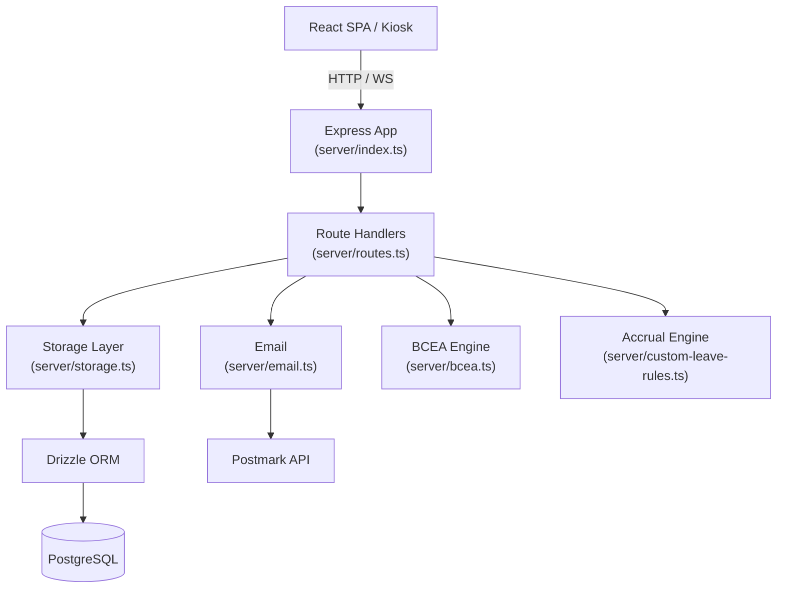

# 02 — Backend Architecture

## Overview

The backend is an **Express 4 application written in TypeScript**, running on Node.js 20. It serves the React SPA as static files and exposes a REST API under `/api`. All persistent state lives in PostgreSQL via Drizzle ORM. There is no microservices split — the entire backend is one process.

---

## Layers



---

## Entry Point (`server/index.ts`)

Responsibilities on startup:

1. Configure Express middleware (JSON body parser, session, Passport)
2. Register all routes from `routes.ts`
3. Mount static file serving for the built React SPA
4. Start HTTP server on `PORT` (default `5000`)

**Session setup:**
```typescript
app.use(session({
  store: new PgSession({ pool }),      // Sessions persisted in PostgreSQL
  secret: process.env.SESSION_SECRET,
  resave: false,
  saveUninitialized: false,
  cookie: {
    maxAge: 8 * 60 * 60 * 1000,       // 8-hour session lifetime
    httpOnly: true,
    secure: process.env.TRUST_PROXY === 'true'
  }
}));
```

---

## Authentication (`server/routes.ts`)

Three authentication paths exist, all managed by Passport.js:

| Path | Endpoint | Mechanism |
|------|----------|-----------|
| Worker | `POST /api/auth/login` | Employee ID lookup + optional bcrypt password check |
| Admin | `POST /api/auth/admin-login` | Email lookup + bcrypt password check |
| Biometric | `POST /api/auth/login-by-face` | Face descriptor cosine distance against stored embeddings |

### Face authentication detail
The kiosk sends a 128-dimensional face embedding from the browser (computed by `@vladmandic/face-api`). The server fetches all stored descriptors from the `faceDescriptors` table, computes Euclidean distance for each, and returns the matching user if distance is below a configured threshold. No session is created for kiosk face auth — attendance records are written directly.

### Public routes (no session required)
These routes bypass the `requireAuth` middleware:
- `GET /api/users/face-descriptors` — face models needed by kiosk on page load
- `POST /api/attendance` — clock-in/out for kiosk
- `GET /api/attendance/status/:userId` — clock-in status check for kiosk display
- All `/api/auth/*` routes

### Authorization middleware
```typescript
function requireAuth(req, res, next) { ... }         // Any authenticated user
function requireAdmin(req, res, next) { ... }        // admin role only
function requireAdminOrManager(req, res, next) { ... }  // admin or manager
```

Admins with `hasFullAdminAccess = 'no'` see only their assigned department's employees. Admins with `adminRole = 'maintainer'` cannot access system settings routes.

---

## Route Structure (`server/routes.ts`)

All routes are registered on a single Express `Router`. The file is ~3200 lines and covers:

| Domain | Prefix | Auth required |
|--------|--------|---------------|
| Auth | `/api/auth` | Partial (see above) |
| Users | `/api/users` | Yes |
| Leave balances | `/api/leave-balances` | Yes |
| Leave requests | `/api/leave-requests` | Yes |
| Attendance | `/api/attendance` | Partial (kiosk routes public) |
| Departments | `/api/departments` | Admin |
| User groups | `/api/user-groups` | Admin |
| Employee types | `/api/employee-types` | Admin |
| Leave rules | `/api/leave-rules` | Admin |
| Public holidays | `/api/public-holidays` | Admin |
| Companies | `/api/companies` | Admin |
| Org positions | `/api/org-positions` | Admin |
| Grievances | `/api/grievances` | Yes |
| Notifications | `/api/notifications` | Yes |
| Settings | `/api/settings` | Admin |
| Audit logs | `/api/audit-logs` | Admin |
| Reports | `/api/reports` | Admin |

---

## Storage Layer (`server/storage.ts`)

All database access is routed through a single `storage` object. This is a plain TypeScript module (not a class) that exports typed functions for every CRUD operation.

**Why this matters:** routes never import Drizzle directly. They call `storage.getUser(id)`, `storage.createLeaveRequest(data)`, etc. This keeps query logic out of route handlers and makes the data access pattern consistent.

```typescript
// Example shape
export const storage = {
  getUser: (id: string) => db.select().from(users).where(eq(users.id, id)).limit(1),
  createLeaveRequest: (data: InsertLeaveRequest) => db.insert(leaveRequests).values(data).returning(),
  // ...100+ more functions
};
```

---

## Business Logic Modules

### `server/bcea.ts` — BCEA Leave Calculations
Implements South African Basic Conditions of Employment Act entitlements:
- Annual leave: 21 days per 12-month cycle, pro-rated monthly from start date
- Sick leave: 30 days per 3-year cycle, pro-rated monthly
- Family responsibility: 3 days per cycle, available from month 4
- Statutory leave types: maternity (87 days), parental (10 days), adoption (50 days)

See [05 — Leave Domain](05-leave-domain.md) for full detail.

### `server/custom-leave-rules.ts` — Custom Accrual Engine
Evaluates configurable `leaveRules` and `leaveRulePhases` records against an employee's tenure and working day history to calculate earned leave. Supports four accrual types: `per_days_worked`, `monthly`, `annual`, `fixed_per_cycle`.

### `server/email.ts` — Email Templates
Wraps the Postmark client. Each exported function corresponds to a transactional email type:
- Leave request submitted / approved / rejected
- Manager reminder (pending approval > 3 days)
- AWOL alert
- Credentials delivery
- Password reset link

Email is fire-and-forget — failures are logged but do not cause API errors. If `POSTMARK_API_KEY` is absent, all email functions no-op silently.

---

## Audit Logging

Any admin mutation that changes user or leave balance data calls `storage.createAuditLog()`. The log records:
- `actor_id` — who made the change
- `action` — e.g. `update_user`, `adjust_leave_balance`
- `entity_type` / `entity_id` — what was changed
- `changes` — JSON diff with `before` and `after` values
- `timestamp`

Logs are queryable via `GET /api/audit-logs` (admin only).

---

## WebSocket

A `ws` WebSocket server is attached to the HTTP server for real-time features (live attendance updates on the kiosk tile view). The WebSocket server is lightweight — it broadcasts attendance events to connected clients but does not manage per-user channels or authentication.

---

## Error Handling

Route handlers use a consistent pattern:
```typescript
try {
  // ...
} catch (error) {
  console.error('Description:', error);
  res.status(500).json({ message: 'Error message' });
}
```

There is no global error-handling middleware. Errors are logged to stdout and return a 500 with a plain JSON message. In production (Docker), stdout is captured by Docker's logging driver.
