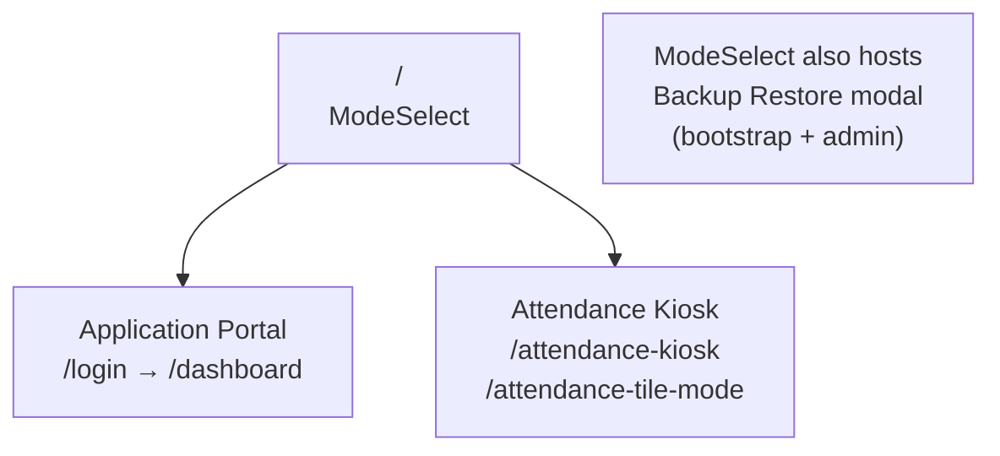

# 03 — Frontend Architecture

## Overview

The frontend is a **React 19 SPA** built with Vite 7. It is served as static files from the Express backend (`dist/`) — there is no separate frontend hosting. Routing is handled client-side by Wouter. The app has two distinct operating modes: the **application portal** (all authenticated roles) and the **attendance kiosk** (sessionless, shared device).

---

## Application Modes



| Mode | Entry | Auth | Primary users |
|------|-------|------|---------------|
| Application portal | `/login` | Session (email + password) | All roles |
| Kiosk | `/attendance-kiosk` | None (face/ID only) | Shared devices |

The ModeSelect home page (`/`) also hosts the **Backup Restore** modal with two flows:
- **Bootstrap restore** — available on empty database without login, for first-time setup from a backup
- **Admin restore** — requires login, additive-only import (never overwrites existing records)

---

## Routing (`client/src/App.tsx`)

Wouter is used instead of React Router. Routes are defined as a flat list in `App.tsx`:

```
/                          ModeSelect (+ backup restore modal)
/login                     Login (email + password)
/admin                     AdminLogin (legacy entry point)
/dashboard                 Unified dashboard (all roles, tab-based)
/admin/dashboard           AdminDashboard (same component, admin entry)
/leave-request             Leave request form
/attendance                Manual attendance entry
/attendance-kiosk          Face/ID kiosk
/attendance-tiles          Tile kiosk view (primary route)
/attendance-tile           Tile kiosk view (alias)
/maintainer/dashboard      Admin-only maintainer dashboard
/employee-profile          Profile view/edit
/org-chart                 Org hierarchy visualisation
/grievances                Grievance submission
/attendance-reports        Attendance analytics
/leave-calendar            Visual leave timeline
/reset-password            Password reset via token
```

Protected routes check `AuthContext` and redirect to `/login` if no session exists.

---

## Unified Dashboard

All authenticated users land on a single dashboard (`AdminDashboard.tsx`) with a left-sidebar navigation. Visible tabs are determined by the user's roles — no separate portals for workers vs. admins.

**Self-service tabs (visible to all authenticated users):**
| Tab | Component | Purpose |
|-----|-----------|---------|
| My Dashboard | `EmployeeDashboardSection` | Leave summary, quick stats, upcoming leave |
| My Profile | `MyProfileSection` | Edit own profile, photo capture, password change |
| My Attendance | `MyAttendanceSection` | Own clock-in/out history |

**Role-gated tabs:**
| Tab | Roles | Component |
|-----|-------|-----------|
| Personnel | hr, admin | `PersonnelSection` |
| Leave Requests | manager, hr, admin | `LeaveRequestsSection` |
| Attendance | manager, hr, admin | `AttendanceSection` |
| Leave Calendar | hr, admin | `LeaveCalendarSection` |
| Leave Rules | admin | `LeaveRulesSection` (includes custom leave rule phases) |
| Org Positions | admin | `OrgPositionsSection` |
| Departments | admin | `DepartmentsSection` |
| Companies | admin | `CompaniesSection` |
| Employee Types | admin | `EmployeeTypesSection` |
| Grievances | hr, admin | `GrievancesSection` |
| Public Holidays | admin | `PublicHolidaysSection` |
| Settings | admin | `SettingsSection` (includes `annual_leave_cycle_start`, branding, etc.) |
| Database Backup | admin | `DatabaseBackupSection` |
| Admin Insights | admin | `DashboardSection` |

> **Note:** Accrual rate tiers (`accrual_rate_tiers` table) are currently managed only via direct DB or API — there is no dedicated frontend UI for editing them. Default tiers (Tier 1: 15 days, Tier 2 at 24 months: 20 days) are seeded on first migration.

---

## State Management

The app uses two complementary state mechanisms:

### TanStack React Query (server state)
All data fetched from the API is managed by React Query. This handles caching, background refetching, and cache invalidation. Example pattern:

```typescript
const { data: leaveBalances } = useQuery({
  queryKey: ['/api/leave-balances', userId],
  queryFn: () => api.getLeaveBalances(userId),
});

const mutation = useMutation({
  mutationFn: api.createLeaveRequest,
  onSuccess: () => queryClient.invalidateQueries(['/api/leave-requests']),
});
```

### React Context (global client state)

| Context | File | What it holds |
|---------|------|---------------|
| `AuthContext` | `client/src/lib/auth-context.tsx` | Current user object, `hasRole()` helper, login/logout |
| `ThemeContext` | `client/src/lib/theme-context.tsx` | Light/dark mode preference |

`AuthContext` exposes a `hasRole(role)` helper used throughout the app to conditionally render UI elements. It also persists the user to `localStorage` to prevent flash-of-unauthenticated-content on page reload.

---

## API Client (`client/src/lib/api.ts`)

All API calls go through typed wrapper functions in `api.ts`, not raw `fetch` calls from components. This provides:
- Consistent error handling
- Typed request/response shapes (using Zod-inferred types from `shared/schema.ts`)
- Single place to change base URL or add auth headers

---

## Component Structure

```
client/src/
├── pages/                  # Route-level components (one per route)
│   ├── ModeSelect.tsx      # Home page + backup restore modal
│   ├── Login.tsx
│   ├── AdminLogin.tsx
│   ├── Dashboard.tsx
│   ├── AdminDashboard.tsx  # Unified dashboard (all roles)
│   ├── AttendanceKiosk.tsx
│   ├── AttendanceTileMode.tsx
│   ├── OrgChart.tsx        # D3-based org hierarchy visualisation
│   └── admin/              # Dashboard section components (role-gated)
│       ├── MyProfileSection.tsx
│       ├── MyAttendanceSection.tsx
│       ├── EmployeeDashboardSection.tsx
│       ├── PersonnelSection.tsx
│       ├── LeaveRequestsSection.tsx
│       ├── AttendanceSection.tsx
│       ├── LeaveCalendarSection.tsx
│       ├── LeaveRulesSection.tsx
│       ├── OrgPositionsSection.tsx
│       ├── DepartmentsSection.tsx
│       ├── CompaniesSection.tsx
│       ├── EmployeeTypesSection.tsx
│       ├── GrievancesSection.tsx
│       ├── PublicHolidaysSection.tsx
│       ├── SettingsSection.tsx
│       ├── DatabaseBackupSection.tsx
│       └── DashboardSection.tsx
├── components/
│   ├── ui/                 # Radix UI wrappers (shadcn/ui pattern)
│   ├── Layout.tsx          # App shell with nav
│   ├── ThemeToggle.tsx
│   ├── NotificationBell.tsx
│   ├── WebcamCapture.tsx           # Single-shot photo capture
│   └── MultiAngleFaceCapture.tsx   # Multi-angle face capture for recognition training
└── hooks/                  # Custom React hooks
```

---

## UI Library

The app uses **Radix UI** primitives styled with **Tailwind CSS 4**, following the shadcn/ui pattern. Components in `client/src/components/ui/` are thin wrappers around Radix primitives with Tailwind class variants applied via `class-variance-authority`.

### Dynamic Branding
Primary and accent colors are stored in the `settings` table and loaded on app startup. They are converted from hex to HSL and injected as CSS custom properties (`--primary`, `--accent`) on the `<html>` element:

```typescript
document.documentElement.style.setProperty('--primary', `${h} ${s}% ${l}%`);
```

This allows per-instance branding without a rebuild.

---

## Theme System

The app supports **light**, **dark**, and **system** (OS preference) modes, persisted to `localStorage` under the key `aece_theme`.

### Mechanism

`ThemeContext` (`client/src/lib/theme-context.tsx`) applies or removes the `.dark` class on the `<html>` element. Tailwind v4 is configured with `@custom-variant dark (&:is(.dark *))`, so any `dark:` prefix resolves to a descendant-of-`.dark` selector.

### Semantic Token Approach

All theme-sensitive colors use **CSS custom property-backed semantic tokens** defined in `client/src/index.css`. These tokens resolve automatically in both light and dark mode — no `dark:` variant is needed on individual components.

Core tokens (`:root` = light, `.dark {}` = dark):

| CSS class | Purpose |
|-----------|---------|
| `bg-card` / `text-card-foreground` | Card/panel backgrounds |
| `bg-muted` / `text-muted-foreground` | Subdued backgrounds and secondary text |
| `bg-primary` / `text-primary-foreground` | Brand/action color |
| `text-destructive` / `bg-destructive/10` | Errors, danger states |
| `bg-status-success` / `bg-status-success-muted` | Positive states (clocked-in, approved) |
| `bg-status-warning` / `bg-status-warning-muted` | Caution states (pending, carry-over expiry) |
| `bg-status-info` / `bg-status-info-muted` | Informational states (notifications, projections) |
| `bg-status-neutral` / `bg-status-neutral-muted` | Neutral/unknown states |

### Rules for future development

1. **Never use hardcoded Tailwind palette classes** (`bg-green-100`, `text-red-600`, `bg-blue-50`, etc.) on theme-sensitive elements. These are invisible to the CSS variable system and will break in dark mode.
2. **Never add a `dark:` variant to a palette class** as a workaround (e.g. `bg-green-100 dark:bg-green-900`). Use a semantic token instead.
3. **Exceptions — categorical color distinctions:** Where color conveys distinct category identity (e.g. leave type calendar colors, org chart department colors), paired `dark:` variants on palette classes are acceptable since there is no semantic token equivalent. Use the pattern `bg-blue-100 dark:bg-blue-900/40`.
4. **SVG `style` attributes:** SVG elements cannot use Tailwind classes for fill/stroke. Use `hsl(var(--token-name))` in inline styles (e.g. `backgroundColor: 'hsl(var(--card))'`).

### Color mapping reference

| Old hardcoded class | Semantic replacement |
|---------------------|---------------------|
| `bg-green-* / text-green-*` | `bg-status-success-muted / text-status-success` |
| `bg-red-* / text-red-*` | `bg-destructive/10 / text-destructive` |
| `bg-amber-* / bg-orange-*` | `bg-status-warning-muted / text-status-warning` |
| `bg-blue-*` | `bg-status-info-muted / text-status-info` |
| `bg-slate-50 / bg-gray-50` | `bg-muted/50` |
| `bg-slate-100` | `bg-muted` |
| `bg-white` | `bg-card` |
| `text-slate-* / text-gray-*` | `text-foreground` or `text-muted-foreground` |

---

## Face Recognition (Client-side)

`@vladmandic/face-api` runs **in the browser** on the kiosk. The kiosk page:
1. Loads all face descriptors from `GET /api/users/face-descriptors` on mount
2. Opens the webcam
3. For each video frame, computes a 128-dimensional face embedding
4. Finds the nearest stored descriptor by Euclidean distance
5. If distance < threshold, sends `POST /api/attendance` with the matched user ID

Face detection is computationally local — no video is sent to the server. Only the matched user ID and a photo snapshot are sent.

Multi-angle face capture (`MultiAngleFaceCapture`) is used during employee onboarding to store several descriptors per user (front, left, right, etc.), improving recognition accuracy.

---

## Forms

All forms use **React Hook Form** with **Zod resolvers**. The Zod schemas are imported directly from `shared/schema.ts`, ensuring client-side validation matches server-side validation exactly:

```typescript
const form = useForm<InsertLeaveRequest>({
  resolver: zodResolver(insertLeaveRequestSchema),
});
```

---

## Attendance Kiosk Modes

Two kiosk layouts exist for different physical deployments:

| Mode | Route | Layout | Best for |
|------|-------|--------|----------|
| Standard kiosk | `/attendance-kiosk` | Full-screen face scan + recent clock activity | Single-employee kiosk |
| Tile mode | `/attendance-tile-mode` | Grid of employee tiles showing status | Wall-mounted display showing team status |

Both modes are sessionless and auto-refresh without user interaction.

---

## Build

Vite builds the SPA to `dist/`. The Express server serves `dist/index.html` for all non-API routes (SPA fallback). The build is triggered by `script/build.ts`, which runs Vite then esbuild for the server bundle.

See [07 — Infrastructure](07-infrastructure.md) for the full build and deployment pipeline.
