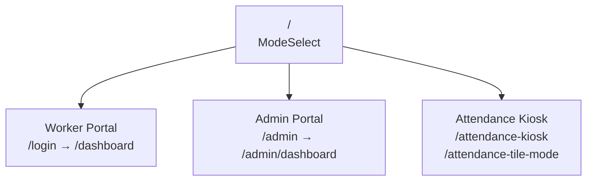

# 03 — Frontend Architecture

## Overview

The frontend is a **React 19 SPA** built with Vite 7. It is served as static files from the Express backend (`dist/public/`) — there is no separate frontend hosting. Routing is handled client-side by Wouter. The app has three distinct operating modes: worker portal, admin portal, and attendance kiosk.

---

## Application Modes



| Mode | Entry | Auth | Primary users |
|------|-------|------|---------------|
| Worker portal | `/login` | Session (ID + password) | Employees |
| Admin portal | `/admin` | Session (email + password) | HR, managers |
| Kiosk | `/attendance-kiosk` | None (face/ID only) | Shared devices |

The kiosk modes are intentionally sessionless — they call the public attendance API directly without login.

---

## Routing (`client/src/App.tsx`)

Wouter is used instead of React Router. Routes are defined as a flat list in `App.tsx`:

```
/                          ModeSelect
/login                     Worker login
/admin                     Admin login
/dashboard                 Worker dashboard
/admin/dashboard           Admin dashboard (with sub-sections)
/leave-request             Leave request form
/attendance                Manual attendance entry
/attendance-kiosk          Face/ID kiosk
/attendance-tile-mode      Tile kiosk view
/employee-profile          Profile view/edit
/org-chart                 Org hierarchy visualisation
/grievances                Worker grievance submission
/attendance-reports        Admin attendance analytics
/leave-calendar            Visual leave timeline
```

Protected routes check `AuthContext` and redirect to the appropriate login if no session exists.

---

## State Management

The app uses two complementary state mechanisms:

### TanStack React Query (server state)
All data fetched from the API is managed by React Query. This handles caching, background refetching, and cache invalidation. Example pattern:

```typescript
const { data: leaveBalances } = useQuery({
  queryKey: ['/api/leave-balances', userId],
  queryFn: () => api.getLeaveBalances(userId),
});

const mutation = useMutation({
  mutationFn: api.createLeaveRequest,
  onSuccess: () => queryClient.invalidateQueries(['/api/leave-requests']),
});
```

### React Context (global client state)

| Context | File | What it holds |
|---------|------|---------------|
| `AuthContext` | `client/src/lib/auth-context.tsx` | Current user object, login/logout functions |
| `ThemeContext` | `client/src/lib/theme-context.tsx` | Light/dark mode preference |

`AuthContext` also persists the user to `localStorage` as a fallback for page reloads before the `/api/auth/me` response returns. This prevents flash-of-unauthenticated-content.

---

## API Client (`client/src/lib/api.ts`)

All API calls go through typed wrapper functions in `api.ts`, not raw `fetch` calls from components. This provides:
- Consistent error handling
- Typed request/response shapes (using Zod-inferred types from `shared/schema.ts`)
- Single place to change base URL or add auth headers

---

## Component Structure

```
client/src/
├── pages/                  # Route-level components (one per route)
│   ├── Dashboard.tsx
│   ├── AdminDashboard.tsx
│   ├── LeaveRequest.tsx
│   ├── AttendanceKiosk.tsx
│   └── ...
├── components/
│   ├── admin/              # Admin-specific sections
│   │   ├── DashboardSection.tsx
│   │   ├── PersonnelSection.tsx
│   │   ├── LeaveRequestsSection.tsx
│   │   ├── AttendanceSection.tsx
│   │   ├── OrgPositionsSection.tsx
│   │   ├── DatabaseBackupSection.tsx
│   │   └── ...
│   ├── ui/                 # Radix UI wrappers (shadcn/ui pattern)
│   │   ├── button.tsx
│   │   ├── dialog.tsx
│   │   ├── select.tsx
│   │   └── ...
│   ├── Layout.tsx          # App shell with nav
│   ├── ThemeToggle.tsx
│   ├── NotificationBell.tsx
│   ├── WebcamCapture.tsx   # Face capture for registration
│   └── MultiAngleFaceCapture.tsx
└── hooks/                  # Custom React hooks
```

---

## UI Library

The app uses **Radix UI** primitives styled with **Tailwind CSS 4**, following the shadcn/ui pattern. Components in `client/src/components/ui/` are thin wrappers around Radix primitives with Tailwind class variants applied via `class-variance-authority`.

**Components in use:** Accordion, Alert Dialog, Avatar, Badge, Button, Card, Checkbox, Collapsible, Command, Dialog, Dropdown Menu, Form, Input, Label, Popover, Progress, Radio Group, Resizable Panels, Scroll Area, Select, Separator, Sheet, Sidebar, Skeleton, Slider, Switch, Table, Tabs, Textarea, Tooltip.

### Dynamic Branding
Primary and accent colors are stored in the `settings` table and loaded on app startup. They are converted from hex to HSL and injected as CSS custom properties (`--primary`, `--accent`) on the `<html>` element:

```typescript
document.documentElement.style.setProperty('--primary', `${h} ${s}% ${l}%`);
```

This allows per-instance branding without a rebuild.

---

## Face Recognition (Client-side)

`@vladmandic/face-api` runs **in the browser** on the kiosk. The kiosk page:
1. Loads all face descriptors from `GET /api/users/face-descriptors` on mount
2. Opens the webcam
3. For each video frame, computes a 128-dimensional face embedding
4. Finds the nearest stored descriptor by Euclidean distance
5. If distance < threshold, sends `POST /api/attendance` with the matched user ID

Face detection is computationally local — no video is sent to the server. Only the matched user ID and a photo snapshot are sent.

---

## Forms

All forms use **React Hook Form** with **Zod resolvers**. The Zod schemas are imported directly from `shared/schema.ts`, ensuring client-side validation matches server-side validation exactly:

```typescript
const form = useForm<InsertLeaveRequest>({
  resolver: zodResolver(insertLeaveRequestSchema),
});
```

---

## Attendance Kiosk Modes

Two kiosk layouts exist for different physical deployments:

| Mode | Route | Layout | Best for |
|------|-------|--------|----------|
| Standard kiosk | `/attendance-kiosk` | Full-screen face scan + recent clock activity | Single-employee kiosk |
| Tile mode | `/attendance-tile-mode` | Grid of employee tiles showing status | Wall-mounted display showing team status |

Both modes are sessionless and auto-refresh without user interaction.

---

## Build

Vite builds the SPA to `dist/public/`. The Express server serves `dist/public/index.html` for all non-API routes (SPA fallback). The build is triggered by `script/build.ts`, which runs Vite then esbuild for the server bundle.

See [07 — Infrastructure](07-infrastructure.md) for the full build and deployment pipeline.
