# 04 — Data Architecture

## Overview

All data is stored in a single **PostgreSQL 16** database (name: `factoryflow`). The schema is defined in `shared/schema.ts` using **Drizzle ORM** table definitions, with corresponding **Zod validators** for API input validation. Migrations are managed by Drizzle Kit and run automatically on container startup.

---

## Entity Relationship Overview

```mermaid
erDiagram
    users ||--o{ leaveRequests : "submits"
    users ||--o{ leaveBalances : "has"
    users ||--o{ leaveAccrualRecords : "has"
    users ||--o| sickLeaveTracking : "has"
    users ||--o{ attendanceRecords : "clocks"
    users ||--o{ faceDescriptors : "has"
    users ||--o{ grievances : "submits"
    users ||--o{ notifications : "receives"
    users ||--o{ contractHistory : "has"

    users }o--|| departments : "belongs to"
    users }o--|| employeeTypes : "classified as"
    users }o--|| userGroups : "assigned to"
    users }o--|| companies : "payroll via"
    users }o--|| orgPositions : "occupies"
    users }o--o| users : "reports to (manager)"

    leaveRequests }o--|| users : "recommended by manager"
    leaveRequests }o--|| users : "approved by HR"
    leaveRequests }o--|| users : "approved by MD"

    leaveRules ||--o{ leaveRulePhases : "has phases"
    leaveRules }o--|| employeeTypes : "applies to"

    orgPositions }o--o| orgPositions : "parent position"

    accrualRateTiers ||--|| accrualRateTiers : "system-wide config"
```



---

## Tables

### `users`

The central entity. Every employee is a user record.

| Column | Type | Notes |
|--------|------|-------|
| `id` | text PK | Employee ID (e.g. `EMP001`) — user-assigned, changeable |
| `firstName`, `surname` | text | |
| `nickname` | text | Optional display name |
| `email` | text | Required for login |
| `password` | text | bcrypt hash |
| `mobile`, `homeAddress` | text | |
| `gender`, `religion` | text | Optional profile fields |
| `role` | text | **Legacy** — kept for backwards compatibility; use `roles[]` as source of truth |
| `adminRole` | text | **Legacy** — kept for backwards compatibility |
| `hasFullAdminAccess` | text | **Legacy** — kept for backwards compatibility |
| `roles` | text[] | Current role set: `['employee', 'manager', 'hr', 'admin']`. Additive; `admin` satisfies all guards |
| `department` | text | Department name |
| `userGroupId` | FK → `userGroups` | Admin grouping |
| `employeeTypeId` | FK → `employeeTypes` | |
| `nationalId` | text | National ID number |
| `taxNumber` | text | Tax number |
| `nextOfKin` | text | Next of kin name and relationship |
| `emergencyNumber` | text | Emergency contact number |
| `popiaWaiverUrl` | text | URL to uploaded POPIA waiver document |
| `startDate` | text | Employment start date — drives all leave accrual, sick leave cycle |
| `contractEndDate` | text | Null for permanent employees |
| `terminationDate` | text | Set on offboarding; triggers termination settlement accrual |
| `workDaysPerWeek` | integer | Standard working days/week (1–7). Affects sick leave entitlement (`30 × workDays/5`) and FRL eligibility (`>= 4`). Default 5. |
| `annualLeaveOverrideDays` | real | Optional HR override for annual leave entitlement (days/year). When set, `RATE = override / 12` and tier logic is skipped entirely. Null = use tiers. |
| `managerId` | FK → `users` (self) | Primary approver |
| `secondManagerId` | FK → `users` (self) | Secondary approver |
| `orgPositionId` | FK → `orgPositions` | Position in org chart |
| `reportsToPositionId` | FK → `orgPositions` | Position they report to |
| `companyId` | FK → `companies` | Payroll company |
| `photoUrl` | text | Profile photo path |
| `faceDescriptor` | text | **Legacy** single JSON 128-float array; superseded by `faceDescriptors` table |
| `exclude` | boolean | Hide from org chart and attendance (offboarded/test users) |
| `excludeFromLeave` | boolean | Skip leave accrual calculations |
| `attendanceRequired` | boolean | Whether this user must clock in/out |

### `leaveBalances`

One row per user per leave type.

| Column | Type | Notes |
|--------|------|-------|
| `id` | serial PK | |
| `userId` | FK → `users` | |
| `leaveType` | text | `Annual Leave`, `Sick Leave`, `Family Responsibility`, or custom name |
| `total` | real | Current cycle entitlement (not rounded — full decimal precision retained per spec) |
| `taken` | real | Days used (settled) |
| `pending` | real | Days in pending/approved requests not yet settled |
| `carryOverDays` | real | Prior-cycle balance subject to grace period and forfeiture |
| `carryOverExpiry` | text | `yyyy-MM-dd` — carry-over flagged for HR forfeiture action after this date |

**Available balance for display:** `total + carryOverDays - taken - pending`

### `leaveAccrualRecords`

One row per accrual event. The unique constraint on `(employee_id, leave_type, accrual_period, event_type)` is the idempotency mechanism — running the accrual engine twice for the same month produces no duplicates.

| Column | Type | Notes |
|--------|------|-------|
| `id` | serial PK | |
| `employeeId` | FK → `users` | |
| `leaveType` | text | Leave type affected |
| `accrualPeriod` | text | `YYYY-MM` — the calendar month being credited |
| `eventType` | text | `monthly_accrual`, `pro_rated_accrual`, `sick_leave_graduated_credit`, `sick_leave_transition`, `sick_leave_cycle_reset`, `cycle_reset`, `frl_cycle_reset`, `termination_settlement`, `manual_adjustment`, `forfeiture_actioned` |
| `amount` | real | Days credited, debited, or forfeited |
| `balanceBefore` | real | Balance immediately before this event |
| `balanceAfter` | real | Balance immediately after this event |
| `calculationBasis` | text | Human-readable explanation (e.g. `"1.25 × (17/31) = 0.6854 — partial month, Tier 1"`) |
| `triggeredBy` | text | `system` for automated runs; `user_id` for manual adjustments |
| `metadata` | jsonb | Additional context (e.g. `{"activeDays": 17, "totalDays": 31, "pausingLeaveDays": 0}`) |
| `createdAt` | timestamp | |

**Unique constraint:** `(employee_id, leave_type, accrual_period, event_type)`

### `accrualRateTiers`

System-wide, HR-editable. Determines the annual leave accrual rate by months of service. Employees without a per-employee override use the highest tier they qualify for.

| Column | Type | Notes |
|--------|------|-------|
| `id` | serial PK | |
| `minMonthsOfService` | integer | Minimum completed months to qualify for this tier (inclusive) |
| `annualEntitlementDays` | real | Annual leave days per 12-month cycle at this tier |

**Derived:** `monthlyAccrualRate = annualEntitlementDays / 12`

**Default seed values:**

| Tier | Min months | Annual days | Monthly rate |
|------|-----------|-------------|--------------|
| 1 | 0 | 15 | 1.25 days/month |
| 2 | 24 | 20 | 1.6667 days/month |

### `sickLeaveTracking`

One row per employee. Tracks state needed for the 6-month graduated accrual phase and 36-month cycle resets. The sick leave cycle is anchored to `employment_start_date` (per-employee, can start mid-month — unlike the system-wide annual leave cycle).

| Column | Type | Notes |
|--------|------|-------|
| `id` | serial PK | |
| `userId` | text UNIQUE FK → `users` | |
| `sickCycleStartDate` | text | `yyyy-MM-dd` — start of current 36-month cycle (initially = `employment_start_date`) |
| `graduatedAccrualActive` | boolean | True during first 6 months; false after the 6-month transition |
| `cumulativeDaysWorked` | integer | Running counter used for the 1-per-26 rule. Incremented each month with `scheduled_working_days - leave_days_taken`. |
| `graduatedDaysCredited` | integer | Sick days already credited under the 1-per-26 rule. Credits = `floor(cumulativeDaysWorked / 26) - graduatedDaysCredited` |

### `leaveRequests`

| Column | Type | Notes |
|--------|------|-------|
| `id` | serial PK | |
| `userId` | FK → `users` | Employee submitting |
| `leaveType` | text | Matches a `leaveBalances.leaveType` |
| `startDate`, `endDate` | text | Inclusive, `yyyy-MM-dd` |
| `reason` | text | Employee-provided reason |
| `comments` | text | Employee's additional comments |
| `status` | text | See approval workflow in [05 — Leave Domain](05-leave-domain.md) |
| `documents` | text[] | Attachment URLs or base64 |
| `managerApproverId` | FK → `users` | Who acted at manager stage |
| `managerDecision` | text | `recommended` or `not_recommended` |
| `managerNotes`, `managerDecisionAt` | | |
| `hrApproverId` | FK → `users` | Who acted at HR stage |
| `hrDecision` | text | `approved` or `rejected` |
| `hrNotes`, `hrDecisionAt` | | |
| `finalizedById`, `finalizedAt` | | Who/when the final decision was made |
| `requiresMedCert` | boolean | Flagged for sick leave > 2 days or Fri/Mon pattern |
| `medCertFlags` | text | JSON array: `["exceeds_2_days","fri_mon_pattern","public_holiday_adjacent"]` |
| `isHistoric` | boolean | Backfilled from physical records |
| `authorizedBy`, `referenceNumber` | text | Historic entry fields |
| `startHalfDay` | text | `'AM'` or `'PM'` — non-null means the first day is a half-day (0.5 days deducted) |
| `endHalfDay` | text | `'AM'` or `'PM'` — non-null means the last day is a half-day (0.5 days deducted); must be null when `startDate = endDate` |
| `settledAt` | timestamp | Set when approved request's dates have passed and days moved from pending → taken |
| `createdAt`, `updatedAt` | timestamp | |

**Status values:** `pending_manager` → `pending_hr` → `approved` / `rejected` / `cancelled`

### `leaveRules`

Defines custom leave types and their accrual behaviour.

| Column | Type | Notes |
|--------|------|-------|
| `id` | serial PK | |
| `name` | text | Rule name |
| `leaveType` | text | Display name (e.g. `Study Leave`) |
| `employeeTypeId` | FK → `employeeTypes` | Which employee type this rule applies to (null = all) |
| `accrualType` | text | `per_days_worked`, `monthly`, `annual`, `fixed_per_cycle` |
| `daysEarned` | text | Days earned per unit |
| `periodDaysWorked` | integer | Denominator for `per_days_worked` |
| `accrualRate` | text | Legacy field |
| `maxAccrual` | integer | Cap on total balance |
| `carryOverLimit` | integer | Max days to carry into next cycle |
| `waitingPeriodDays` | integer | Days before accrual starts |
| `cycleMonths` | integer | Length of accrual cycle in months |
| `pausesAnnualAccrual` | boolean | If true, days on this leave are subtracted from `active_days` when calculating annual leave accrual, same as unpaid leave. Default false. |
| `cycleAnchor` | text | `calendar_year` (uses system-wide `annual_leave_cycle_start`) or `employment_start_date` (per-employee, can be mid-month) |

### `leaveRulePhases`

Allows tiered accrual rates within a single rule (e.g. different rate during probation).

| Column | Type | Notes |
|--------|------|-------|
| `id` | serial PK | |
| `leaveRuleId` | FK → `leaveRules` (cascade delete) | |
| `sequence` | integer | Phase order (1, 2, 3…) |
| `phaseName` | text | e.g. `"Probation Period"`, `"After 6 Months"` |
| `startsAfterMonths` | integer | Phase activates after X months of employment |
| `startsAfterDaysWorked` | integer | Or activates after X days worked |
| `accrualType` | text | `per_days_worked` or `fixed_per_cycle` |
| `daysEarned` | text | Days earned in this phase |
| `periodDaysWorked` | integer | Days worked to earn 1 unit (for `per_days_worked`) |
| `cycleMonths` | integer | Cycle length for `fixed_per_cycle` |
| `maxBalanceDays` | integer | Maximum balance during this phase |

### `attendanceRecords`

| Column | Type | Notes |
|--------|------|-------|
| `id` | serial PK | |
| `userId` | FK → `users` | |
| `type` | text | `in` or `out` |
| `timestamp` | timestamp | Clock-in/out time |
| `photoUrl` | text | Snapshot from kiosk |
| `method` | text | `face`, `id`, or `manual` |
| `context` | text | `attendance` (kiosk) or `manual` |
| `isInfringement` | text | `true`/`false` as text; flagged as a rule violation |
| `infringementReason` | text | Late, early departure, etc. |

### `orgPositions`

| Column | Type | Notes |
|--------|------|-------|
| `id` | serial PK | |
| `title` | text | Role title (e.g. `"Production Manager"`) |
| `department` | text | |
| `parentPositionId` | FK → `orgPositions` (self) | Hierarchical parent |
| `sortOrder` | integer | Display ordering |
| `tier` | integer | Visual tier within siblings |
| `isOutsourced` | boolean | Marks external/contracted positions |

### Other Tables

| Table | Purpose |
|-------|---------|
| `departments` | Department list with descriptions |
| `userGroups` | User categorisation (e.g. for admin grouping) |
| `employeeTypes` | Employee classification with configurable leave labels and entitlements |
| `companies` | Payroll company assignments |
| `publicHolidays` | Recurring or one-off holidays; supports religion-based filtering |
| `grievances` | Employee complaints with status workflow and priority |
| `contractHistory` | Tracks contract changes: `created`, `extended`, `converted`, `ended` |
| `notifications` | In-app notification queue per user |
| `faceDescriptors` | Multiple face embeddings per user (128-float JSON arrays) with angle labels |
| `auditLogs` | Admin action trail with JSONB before/after diffs |
| `passwordResetTokens` | Time-limited tokens for password reset |
| `settings` | Key-value config store (branding, `annual_leave_cycle_start`, `leave_carry_over_grace_months`, etc.) |
| `sessions` | Express session store (managed by connect-pg-simple, not Drizzle) |

---

## System-Wide Settings Relevant to Leave

| Key | Type | Default | Purpose |
|-----|------|---------|---------|
| `annual_leave_cycle_start` | `MM-DD` | `01-01` | Start date of the annual leave and FRL cycle for all employees. Must be the 1st of a month. |
| `leave_carry_over_grace_months` | integer | `6` | Months after cycle end before prior-cycle carry-over is flagged for forfeiture. |

---

## Migration Strategy

Migrations are managed by **Drizzle Kit**:

- Schema source of truth: `shared/schema.ts`
- Migration output: `migrations/` (SQL files)
- Config: `drizzle.config.ts`

**On container startup**, `docker-entrypoint.sh` runs:
```bash
npx drizzle-kit migrate --config=drizzle.config.ts
```

After migrations, the entrypoint also runs an idempotent SQL block to create unmanaged tables (`sessions`) that Drizzle Kit does not track. There is no rollback mechanism — forward-only migrations only.

### Migration history

| File | What it does |
|------|-------------|
| `0000_grey_sheva_callister.sql` | Initial schema — all core tables |
| `0001_soft_tempest.sql` | Adds `audit_logs` table |
| `0002_leave_settled_at.sql` | Adds `settled_at` to `leave_requests` |
| `0003_leave_accrual_v2.sql` | Adds `work_days_per_week` and `annual_leave_override_days` to `users`; adds `pauses_annual_accrual` and `cycle_anchor` to `leave_rules`; creates `accrual_rate_tiers` (seeded), `sick_leave_tracking`, and `leave_accrual_records` |
| `0004_half_day_leave.sql` | Adds `start_half_day` and `end_half_day` to `leave_requests` |

---

## Data Persistence

All PostgreSQL data is stored on the **host filesystem** at `./data/postgres/`, bind-mounted into the container. This means data survives container restarts, image rebuilds, and Docker reinstalls.

Migrating the database = copying the `./data/` directory to the new host.

See [07 — Infrastructure](07-infrastructure.md) for backup strategy.
