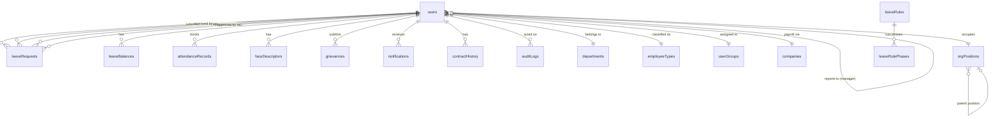

# 04 — Data Architecture

## Overview

All data is stored in a single **PostgreSQL 16** database. The schema is defined in `shared/schema.ts` using **Drizzle ORM** table definitions, with corresponding **Zod validators** for API input validation. Migrations are managed by Drizzle Kit and run automatically on container startup.

---

## Entity Relationship Overview



---

## Tables

### `users`

The central entity. Every employee and admin is a user record.

| Column | Type | Notes |
|--------|------|-------|
| `id` | text PK | Employee ID (e.g. `EMP001`) — user-assigned, changeable |
| `firstName`, `surname` | text | |
| `email` | text | Optional for workers, required for admins |
| `password` | text | bcrypt hash |
| `mobile`, `homeAddress` | text | |
| `gender`, `religion` | text | Optional profile fields |
| `role` | text | `worker`, `manager`, `admin` |
| `adminRole` | text | `manager` or `maintainer` (admin-only) |
| `hasFullAdminAccess` | text | `yes` / `no` — controls cross-department visibility |
| `userGroupId` | FK → `userGroups` | Admin grouping |
| `department` | text | Department name (denormalised) |
| `employeeTypeId` | FK → `employeeTypes` | |
| `startDate` | date | Employment start, drives leave accrual |
| `contractEndDate` | date | Null for permanent employees |
| `terminationDate` | date | Set on offboarding |
| `managerId` | FK → `users` (self) | Primary approver |
| `secondManagerId` | FK → `users` (self) | Secondary approver |
| `orgPositionId` | FK → `orgPositions` | Position in org chart |
| `reportsToPositionId` | FK → `orgPositions` | Position they report to |
| `companyId` | FK → `companies` | Payroll company |
| `photoUrl` | text | Profile photo path |
| `faceDescriptor` | json | Legacy single 128-float array; superseded by `faceDescriptors` table |
| `exclude` | boolean | Hide from most views (offboarded) |
| `excludeFromLeave` | boolean | Skip leave accrual calculations |
| `attendanceRequired` | boolean | Whether this user must clock in/out |

### `leaveBalances`

One row per user per leave type.

| Column | Type | Notes |
|--------|------|-------|
| `id` | serial PK | |
| `userId` | FK → `users` | |
| `leaveType` | text | `annual`, `sick`, `family_responsibility`, or custom name |
| `total` | numeric | Current entitlement |
| `taken` | numeric | Days used |
| `pending` | numeric | Days in pending requests |
| `carryOverDays` | numeric | Days carried from previous cycle |
| `carryOverExpiry` | date | When carry-over expires |

### `leaveRequests`

| Column | Type | Notes |
|--------|------|-------|
| `id` | serial PK | |
| `userId` | FK → `users` | Employee submitting |
| `leaveType` | text | Matches a `leaveBalances.leaveType` |
| `startDate`, `endDate` | date | Inclusive |
| `days` | numeric | Business days calculated at submission |
| `reason` | text | Employee-provided reason |
| `status` | text | See approval workflow below |
| `managerApproverId` | FK → `users` | Who approved at manager stage |
| `managerApprovedAt` | timestamp | |
| `managerNotes` | text | |
| `hrApproverId`, `hrApprovedAt`, `hrNotes` | FK / timestamp / text | HR stage |
| `mdApproverId`, `mdApprovedAt`, `mdNotes` | FK / timestamp / text | MD stage |
| `medicalCertRequired` | boolean | Flagged for sick leave > 2 days |
| `medicalCertReceived` | boolean | Admin confirmation of cert receipt |
| `isHistoric` | boolean | Backfilled from physical records |
| `createdAt` | timestamp | |

**Status values:** `pending_manager` → `pending_hr` → `pending_md` → `approved` / `rejected` / `cancelled`

### `leaveRules`

Defines custom leave types and their accrual behaviour.

| Column | Type | Notes |
|--------|------|-------|
| `id` | serial PK | |
| `name` | text | Display name (e.g. "Study Leave") |
| `accrualType` | text | `per_days_worked`, `monthly`, `annual`, `fixed_per_cycle` |
| `accrualRate` | numeric | Days earned per accrual unit |
| `accrualUnit` | numeric | Unit denominator (e.g. 20 working days per 1 day earned) |
| `maxAccrual` | numeric | Cap on total balance |
| `carryOverLimit` | numeric | Max days to carry into next cycle |
| `waitingPeriodMonths` | numeric | Months before first accrual |
| `cycleMonths` | numeric | Length of accrual cycle in months |
| `applyToBcea` | boolean | Whether BCEA employees are included |
| `employeeTypeIds` | json | Which employee types this rule applies to |

### `leaveRulePhases`

Allows tiered accrual rates within a single rule (e.g. different rate during probation).

| Column | Type | Notes |
|--------|------|-------|
| `id` | serial PK | |
| `leaveRuleId` | FK → `leaveRules` | |
| `fromMonth` | integer | Month number from start date when this phase begins |
| `toMonth` | integer | Month number when this phase ends (null = indefinite) |
| `accrualRate` | numeric | Override rate for this phase |
| `accrualUnit` | numeric | Override unit for this phase |

### `attendanceRecords`

| Column | Type | Notes |
|--------|------|-------|
| `id` | serial PK | |
| `userId` | FK → `users` | |
| `type` | text | `in` or `out` |
| `timestamp` | timestamp | Clock-in/out time |
| `photoUrl` | text | Snapshot from kiosk |
| `method` | text | `face`, `id`, `manual` |
| `context` | text | Additional context (e.g. kiosk location) |
| `isInfringement` | boolean | Flagged as a rule violation |
| `infringementReason` | text | Late, early departure, etc. |

### `orgPositions`

Defines the org chart structure independently of which people fill positions.

| Column | Type | Notes |
|--------|------|-------|
| `id` | serial PK | |
| `title` | text | Role title (e.g. "Production Manager") |
| `department` | text | |
| `parentPositionId` | FK → `orgPositions` (self) | Hierarchical parent |
| `sortOrder` | integer | Display ordering |
| `tier` | integer | Visual tier in org chart |
| `isOutsourced` | boolean | Marks external/contracted positions |

### Other Tables

| Table | Purpose |
|-------|---------|
| `departments` | Department list with descriptions |
| `userGroups` | Admin user categorisation |
| `employeeTypes` | Employee classification with configurable leave labels and entitlements |
| `companies` | Payroll company assignments |
| `publicHolidays` | Recurring or one-off holidays; supports religion-based filtering |
| `grievances` | Employee complaints with status workflow and priority |
| `contractHistory` | Tracks contract changes (extensions, conversions, terminations) |
| `notifications` | In-app notification queue per user |
| `faceDescriptors` | Multiple face embeddings per user (128-float JSON arrays) |
| `auditLogs` | Admin action trail with before/after change diffs |
| `passwordResetTokens` | Time-limited tokens for password reset |
| `settings` | Key-value config store (branding colours, email sender, etc.) |
| `sessions` | Express session store (managed by connect-pg-simple) |

---

## Migration Strategy

Migrations are managed by **Drizzle Kit**:

- Schema source of truth: `shared/schema.ts`
- Migration output: `migrations/` (SQL files)
- Config: `drizzle.config.ts`
- Initial migration: `migrations/0000_grey_sheva_callister.sql` (~11 KB, creates all tables)
- Incremental migrations: numbered sequentially (`0001_...`, `0002_...`, etc.)

**On container startup**, `docker-entrypoint.sh` runs:
```bash
npx drizzle-kit migrate
```

This applies any pending migrations before the app starts. There is no rollback mechanism — forward-only migrations are the pattern.

---

## Data Persistence

All PostgreSQL data is stored on the **host filesystem** at `./data/postgres/`, bind-mounted into the container. This means data survives:
- Container restarts
- Image rebuilds
- Docker reinstalls

Migrating the database = copying the `./data/` directory to the new host.

See [07 — Infrastructure](07-infrastructure.md) for backup strategy.
