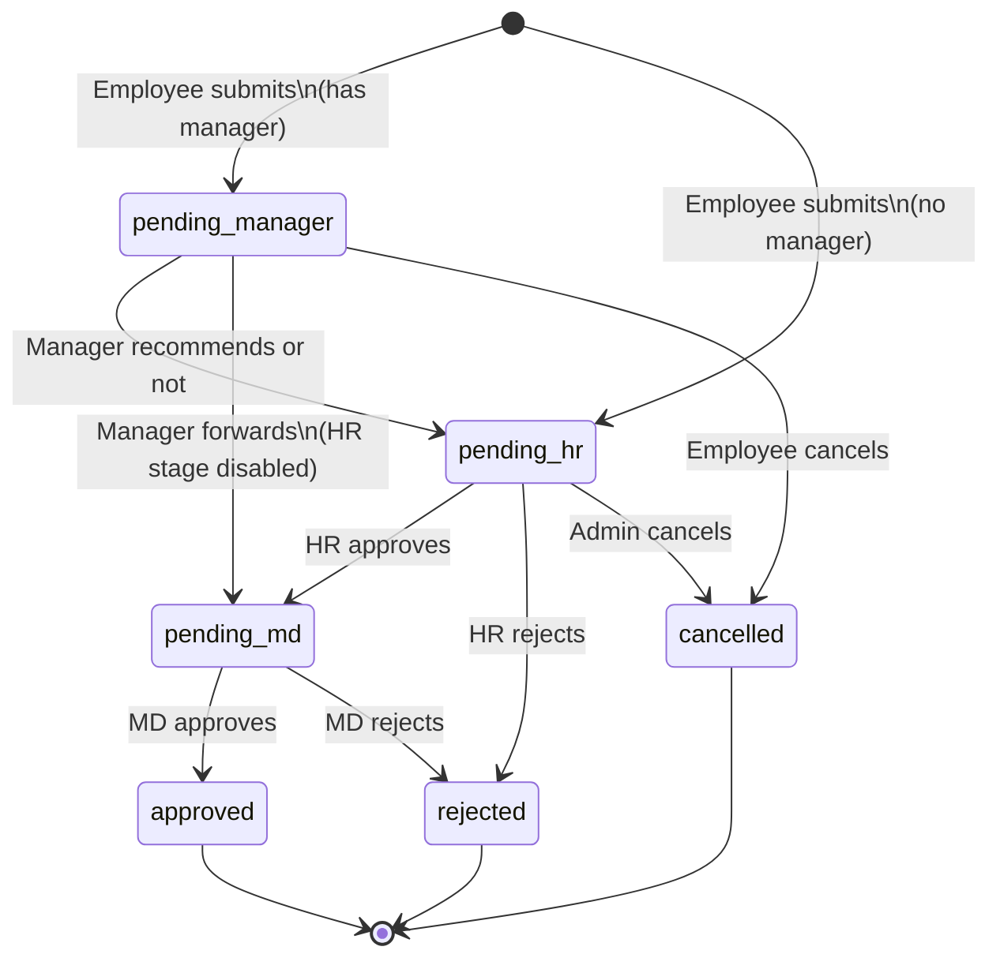

# 05 — Leave Domain

## Overview

Leave management is the core business domain of Factory Flow. It has three subsystems:

1. **BCEA Engine** (`server/bcea.ts`) — pure-logic functions for South African statutory leave calculations
2. **Accrual Orchestration** (`server/leave-accrual.ts`) — queries the DB, calls bcea.ts, writes results
3. **Custom Accrual Engine** (`server/custom-leave-rules.ts`) — configurable rules for non-statutory leave types

The monthly accrual scheduler in `server/index.ts` drives the automated run. All engines write to `leaveBalances` and `leaveAccrualRecords`. Leave requests deduct from balances via a multi-stage approval workflow.

Spec reference: `specs/leave-accrual-implementation-spec.md` (v1.3). Spec is authoritative for all leave calculations.

---

## Cycle Definitions

Three distinct cycle types govern different leave categories:

| Cycle type | Anchor | Length | Leave types |
|-----------|--------|--------|-------------|
| **System-wide calendar** | `annual_leave_cycle_start` setting (default 1 Jan) | 12 months | Annual Leave, FRL |
| **Per-employee employment** | Employee's `employment_start_date` (exact date, can be mid-month) | 36 months | Sick Leave |
| **Per-leave-type configurable** | `cycle_anchor` field on `leaveRules` (`calendar_year` or `employment_start_date`) | `cycle_length_months` on rule | Custom leave types |

Because the annual leave cycle start is always the 1st of a month, no mid-month cycle boundary split is ever needed for annual leave or FRL.

---

## BCEA Leave Types

| Leave type | Entitlement | Cycle | Notes |
|-----------|------------|-------|-------|
| **Annual Leave** | Configurable via rate tiers (default Tier 1: 15 days/yr) | 12-month system-wide calendar cycle | Pro-rated monthly; paused by unpaid/maternity etc. |
| **Sick Leave** | 30 days (full-time) | 36-month per-employee cycle | First 6 months: graduated accrual (1 per 26 days worked); thereafter fixed pool |
| **Family Responsibility Leave (FRL)** | 3 days | 12-month system-wide calendar cycle | Lump sum; eligibility: ≥ 4 months employed AND `workDaysPerWeek >= 4` |
| **Maternity** | 87 working days | Per event | Fixed; not accrued monthly |
| **Parental** | 10 days | Per event | For the non-birthing partner |
| **Adoption** | 50 days | Per event | Primary caregiver |
| **Commissioning Parental** | 50 days | Per event | Surrogacy commissioning parent |

---

## Annual Leave Accrual (Spec §5)

### Rate determination

The monthly accrual rate (`RATE`) is determined per employee on each run:

```
if employee.annual_leave_override_days IS NOT NULL:
    RATE = annual_leave_override_days / 12         ← HR-set override; tier logic skipped
else:
    tier = highest tier where min_months_of_service <= employee's completed months
    RATE = tier.annual_entitlement_days / 12
```

Default tiers (HR-editable in `accrual_rate_tiers` table):

| Tier | Requires | Annual days | Monthly RATE |
|------|---------|-------------|--------------|
| 1 | 0+ months | 15 | 1.25 |
| 2 | 24+ months | 20 | 1.6667 |

When an employee crosses a tier boundary mid-month, the new rate applies to the **entire month** — no split.

The `annual_leave_override_days` field on the employee profile permanently overrides tier logic until HR clears it. Setting or clearing the override is audit-logged.

### Active days formula

The actual accrual amount uses calendar days, not working days:

```
active_days = days_employed_in_month - accrual_pausing_leave_days
accrual     = RATE × (active_days / calendar_days_in_month)
```

`active_days` is reduced below `calendar_days_in_month` when:
- The employee started mid-month (new starter)
- The employee was deactivated mid-month (termination)
- The employee had approved leave of a pausing type during the month

**No rounding** — the exact decimal is stored. Display rounds to 2 decimal places.

### Accrual-pausing leave types

These leave types reduce `active_days` when approved and overlapping the accrual month:

- Unpaid Leave
- Maternity Leave
- Parental Leave
- Adoption Leave
- Commissioning Parental Leave
- Any custom leave type with `pauses_annual_accrual = true`

Sick Leave, Family Responsibility Leave, and Annual Leave itself do **not** pause accrual.

### Termination settlement

When an employee's `terminationDate` is set via `PATCH /api/users/:id`, `processTerminationSettlement()` fires immediately:
1. Calculates pro-rated annual leave for the current partial month
2. Credits to `leaveBalances` immediately (does not wait for the 1st of next month)
3. Writes a `termination_settlement` event to `leaveAccrualRecords`
4. Notifies all HR users with the remaining balance

### Annual leave cycle rollover

At the end of each 12-month cycle (the month before `annual_leave_cycle_start`):
1. Unused balance (`total - taken - pending`) is tagged as `carryOverDays`
2. `leaveBalances.total` is **zeroed** and the new cycle starts fresh
3. `carryOverExpiry` is set to 6 months after cycle end (configurable via `leave_carry_over_grace_months`)
4. Forfeiture warnings are sent to the employee and HR at 60 and 30 days before expiry
5. After expiry: the system flags the record for HR review — **it does not auto-forfeit**. HR must manually action the forfeiture.

---

## Sick Leave Accrual (Spec §6)

### First 6 months — graduated accrual

During the first 6 months of employment, sick leave accrues at 1 day per 26 days worked:

```
days_worked_in_month = scheduled_working_days - leave_days_taken (any type)
cumulative_days_worked += days_worked_in_month
new_credit = floor(cumulative_days_worked / 26) - graduated_days_credited
```

`cumulative_days_worked` and `graduated_days_credited` are persisted per employee in `sickLeaveTracking`.

The system uses **actual leave records** to calculate `leave_days_taken` — it does not approximate.

### 6-month transition

On the 1st of the month following the employee's 6-month anniversary:
1. Calculate full cycle entitlement: `30 × (workDaysPerWeek / 5)`
2. Set balance to `full_entitlement - sick_leave_days_TAKEN` (not accrued — days actually taken)
3. Set `graduated_accrual_active = false`
4. Notify employee and HR

### After transition — fixed pool

After month 6, no monthly accrual occurs. The balance decrements as sick leave is taken and approved.

For part-time employees, the entitlement scales: a 4-day worker gets `30 × (4/5) = 24 days`.

### 36-month cycle reset

When `sick_cycle_start_date + 36 months` is reached (checked on each monthly run):
1. Unused sick leave is **lost** — the balance resets to the full entitlement
2. `sick_cycle_start_date` advances to the new cycle start
3. Employee and HR are notified

The graduated accrual rule does **not** re-apply on subsequent cycles.

---

## Family Responsibility Leave (Spec §7)

FRL is a lump-sum grant (3 days) at the start of each annual leave cycle (same boundary as annual leave). No monthly accrual.

**Eligibility:** Both conditions must be met:
1. Employed for at least 4 months (from `employment_start_date`)
2. `workDaysPerWeek >= 4`

On the 4-month anniversary, the 3 days are granted immediately (no waiting for next cycle). On each subsequent cycle reset, eligibility is re-evaluated against the current `workDaysPerWeek`. If an employee drops below 4 days/week mid-cycle, they retain their remaining FRL for the current cycle but receive no allocation at the next reset. The 4-month employment gate is a one-time check — once passed, it is permanently satisfied.

---

## Custom Leave Types (Spec §9)

Custom leave rules allow organisations to define leave types beyond the BCEA minimum (e.g. study leave, special leave).

Each rule configures:
- `accrual_type`: `none` (approval-only), `lump_sum`, or `monthly`
- `accrual_rate` / `lump_sum_amount`: rate or amount
- `cycle_length_months` + `cycle_anchor`: cycle length and whether it's calendar-year or employment-anchored
- `pauses_annual_accrual`: if true, days on this leave count against annual leave `active_days`
- `carry_over`: whether unused balance carries forward
- `max_days_per_cycle`: optional cap

If `accrual_type = monthly`, the same pro-ration formula applies as annual leave, using the custom `accrual_rate` instead of `RATE`. If `cycle_anchor = employment_start_date`, cycle boundaries can fall mid-month; first and last months are pro-rated.

BCEA-managed types (`Annual Leave`, `Sick Leave`, `Family Responsibility`, and the statutory event leaves) are skipped by the custom engine to prevent conflicts.

---

## Monthly Accrual Run (Spec §4, §14)

**Trigger:** Fires on the **1st of each month**. Credits leave for the **prior calendar month**.

**Idempotency:** Before writing any accrual, `writeAccrualRecord()` checks for an existing `leaveAccrualRecords` row with the same `(employee_id, leave_type, accrual_period, event_type)`. If found, the event is skipped — running the engine twice for the same month is safe.

**Eligible employees:** All employees who were active at any point during the prior month. This includes employees whose `terminationDate` falls within the prior month (they receive a final pro-rated accrual for that month in addition to any immediate termination settlement).

**Processing order per employee:**
1. Determine RATE (override or tier)
2. Calculate `active_days` for the prior month
3. Credit annual leave; write `monthly_accrual` or `pro_rated_accrual` record
4. If in graduated sick period: update `cumulative_days_worked`, credit if threshold crossed
5. Check for sick leave 6-month transition
6. Check for sick leave 36-month cycle reset
7. Check for annual leave cycle rollover (if prior month = last month of cycle)
8. Check for FRL cycle reset (same cycle boundary)
9. Credit custom monthly-accrual leave types
10. Check for forfeiture warnings / flags
11. Settle past approved leave requests (pending → taken)

---

## Leave Request Workflow

### Submission

1. Client sends `POST /api/leave-requests`
2. Server calculates business days (excludes weekends and public holidays matching employee's religion)
3. Checks available balance: `total + carryOverDays - taken - pending >= days`
4. Creates record with `status = 'pending_manager'`
5. Increments `leaveBalances.pending`
6. Notifies manager by email

### Approval stages



The manager's role is **recommendation only** — they cannot approve or reject outright. HR sees the recommendation and can override a "not recommended" decision (shown with a red warning banner). HR and MD hold final approval/rejection authority.

### Settlement

The monthly accrual run calls `settlePastApprovedLeave()` for every eligible employee: approved requests whose `endDate < today` and `settledAt IS NULL` are settled — pending days are moved to taken and `settledAt` is stamped.

### Medical certificate flags

For sick leave requests, `requiresMedCert` is set and `medCertFlags` is populated when:

| Flag | Condition |
|------|-----------|
| `exceeds_2_days` | More than 2 consecutive sick days |
| `fri_mon_pattern` | Includes a Friday adjacent to the following Monday |
| `public_holiday_adjacent` | Adjacent to a public holiday |

---

## Manual Balance Adjustments

HR can directly adjust any leave balance via `PATCH /api/leave-balances/:id`. Requirements:
- A non-empty `reason` is **mandatory** — the API rejects blank reasons with HTTP 400
- Bypasses all validation rules (negative balances are allowed for corrections)
- Effective immediately
- Logged to `audit_logs` with `action = 'manual_adjustment'`, including the reason

---

## Balance Display

| Label | Formula |
|-------|---------|
| Available | `total + carryOverDays - taken - pending` |
| Taken | `taken` |
| Pending | `pending` |
| Total entitlement | `total` |

Carry-over days are displayed separately with their expiry date.

---

## Future Leave Accrual Projection

When an employee selects a leave start date more than 30 days in the future on the request form, the system displays a **projected balance** for that date. This prevents false "insufficient balance" warnings caused by comparing today's balance against future leave.

### 12-month booking limit

Leave requests with a start date more than 12 months from today are **rejected** at both the backend (`POST /api/leave-requests`) and blocked on the frontend calendar. This bound guarantees the projection window crosses at most one annual cycle boundary.

### Projection algorithm

Implemented in `server/leave-projection.ts`. The function `projectLeaveBalance(userId, asOfDate)` mirrors the monthly accrual loop exactly — it processes each future month individually using the same `determineAccrualRate`, `calculateActiveDays`, and `calculateAnnualLeaveAccrual` functions as the real engine.

**Loop:** Iterates from (last accrued month + 1) to (month before `asOfDate`). For each month:
1. Compute accrual using exact BCEA formula
2. If the month is the annual cycle end month → simulate cycle rollover (see below)

**Cycle rollover simulation:** At the cycle-end month the rollover logic from `index.ts` is replicated in-memory:
- Consumed through cycle end = `balance.taken` + working days of approved annual leave requests with `startDate ≤ cycle_end_date`
- `carry_over = max(0, projected_total − consumed_through_cycle_end − days_after_cycle_end)`
- `projected_total` resets to 0; `carry_over` and its expiry are tracked for the final calculation

**Final available:**
- *No cycle reset:* `projected_total + carry_over_at_date − balance.taken − all_active_annual_leave_days`
- *With cycle reset:* `projected_total_new_cycle + carry_over_at_date − settled_days_in_new_cycle − pending_at_asOfDate`

### API endpoint

`GET /api/leave-balances/:userId/projected?leaveType=...&asOfDate=yyyy-MM-dd`

Returns `{ currentAvailable, projectedAvailable, projectedAccrual, cycleResetOccurs, carryOverCreated, carryOverExpiry, monthsProjected, breakdown[] }`.

Sick Leave → 400. Past dates → 400. > 12 months → 400.

### Backend submission behaviour

`POST /api/leave-requests` uses the projection when the current Annual Leave balance is insufficient:

| Situation | Behaviour |
|-----------|-----------|
| Projected available ≥ requested days | Allow submission; append `[Balance note: …]` to `adminNotes` |
| Both current and projected insufficient | Allow submission (HR discretion); append `[Balance warning: …]` to `adminNotes` |
| Non-Annual Leave type insufficient | Hard 400 (unchanged) |

### Frontend

Shown in `LeaveRequest.tsx` when leave type ≠ Sick/Unpaid and start date > 30 days away. Displays current available, per-month accruals, cycle reset details (if any), and projected available with coverage indicator. Calendar dates beyond the 12-month limit are disabled.

---

## Leave Calendar

The leave calendar (`/leave-calendar`) shows a visual timeline of all approved leave requests. Admins see the full organisation; employees see their own leave plus colleagues in their department. Public holidays are overlaid, with religion-specific holidays shown only to employees of the matching religion.
