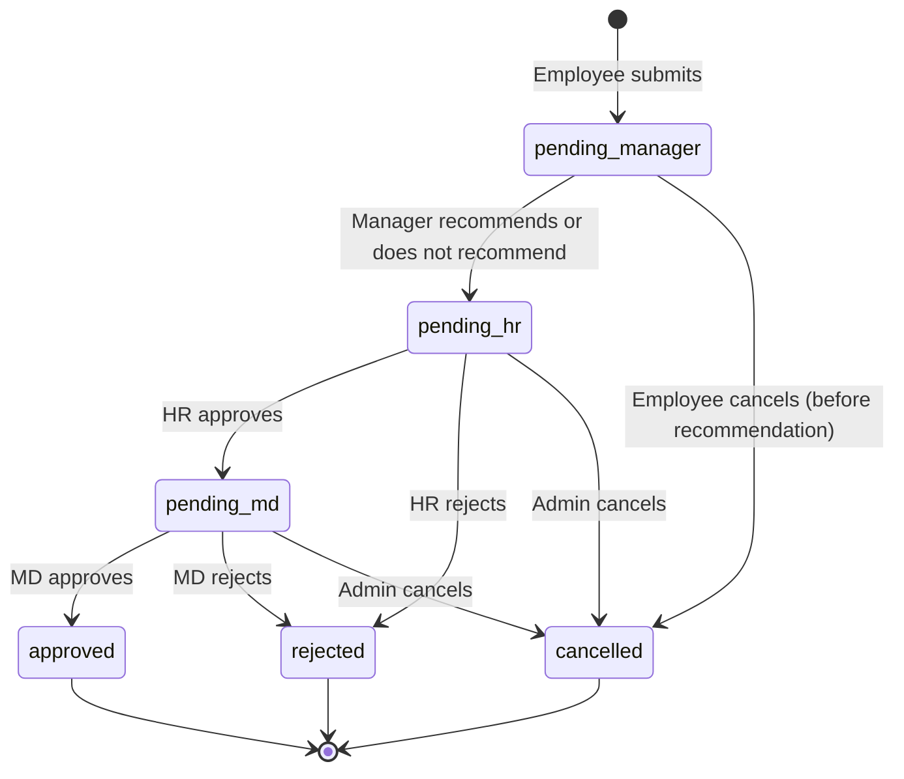

# 05 — Leave Domain

## Overview

Leave management is the core business domain of Factory Flow. It has two distinct subsystems:

1. **BCEA Engine** (`server/bcea.ts`) — statutory South African leave entitlements calculated from an employee's start date
2. **Custom Accrual Engine** (`server/custom-leave-rules.ts`) — configurable rules for non-statutory or organisation-specific leave types

Both engines write to the `leaveBalances` table. Leave requests deduct from balances via a multi-stage approval workflow.

---

## BCEA Leave Types

The Basic Conditions of Employment Act (South Africa) mandates the following:

| Leave type | Entitlement | Cycle | Notes |
|-----------|------------|-------|-------|
| Annual leave | 21 days | 12-month cycle | Pro-rated monthly from start date |
| Sick leave | 30 days | 3-year cycle | First 6 months: 1 day per 26 worked; thereafter full allocation |
| Family responsibility | 3 days | Per 12-month cycle | Available from month 4 of employment |
| Maternity | 87 days | Per event | Not pro-rated |
| Parental | 10 days | Per event | For partner at birth/adoption |
| Adoption | 50 days | Per event | Primary caregiver |
| Commissioning | 50 days | Per event | Surrogacy commissioning parent |

The BCEA engine calculates each employee's entitlement based on their `startDate` and the current date. It is called:
- When a new employee is created
- When `POST /api/leave-balances/recalculate-sa` is triggered (bulk recalculate)
- When an employee type changes

---

## Custom Leave Accrual

Custom leave rules allow organisations to define leave types beyond the BCEA minimum. Examples: study leave, special leave, probation leave.

### Accrual Types

| Type | Behaviour | Use case |
|------|-----------|---------|
| `per_days_worked` | Earn X days per Y working days | Attendance-based accrual |
| `monthly` | Earn X days at the start of each month | Standard monthly allocation |
| `annual` | Earn X days per year on anniversary | Annual grant |
| `fixed_per_cycle` | Flat allocation per N-month cycle | Probation period grants |

### Leave Rule Phases

A single rule can have multiple phases with different accrual rates, activated by months of service:

```
Example: Annual Leave for contractors
  Phase 1 (months 0–5):   earn 1 day per 26 days worked   ← probation rate
  Phase 2 (months 6+):    earn 1.75 days per 26 days worked ← post-probation rate
```

The accrual engine:
1. Looks up all `leaveRules` applicable to the employee's `employeeTypeId`
2. Determines which `leaveRulePhase` is active based on months since `startDate`
3. Applies the phase's rate to the appropriate unit (working days, months, or cycle)
4. Enforces `maxAccrual` cap and `waitingPeriodMonths`
5. Updates `leaveBalances.total`

### Carry-Over

Each leave balance has:
- `carryOverDays` — days carried from the previous cycle
- `carryOverExpiry` — date after which carry-over is forfeited

On cycle renewal, the engine caps carry-over at `leaveRules.carryOverLimit` and sets the expiry date (typically 6 months after the employee's anniversary).

---

## Leave Request Workflow

### Submission

When a worker submits a leave request:
1. Client sends `POST /api/leave-requests` with `leaveType`, `startDate`, `endDate`, `reason`
2. Server calculates business days (excluding weekends and public holidays)
3. Checks sufficient balance (`total - taken - pending >= days`)
4. Creates the record with `status = 'pending_manager'`
5. Increments `leaveBalances.pending`
6. Sends email notification to the employee's manager

### Approval Stages



**Manager recommendation:** The manager submits a recommendation (`recommended` or `not_recommended`) with supporting notes. This always forwards the request to HR — the manager cannot approve or reject. HR sees the recommendation and can override a "not recommended" decision.

**HR stage disabled:** If the `leave_require_hr_stage` setting is `false`, the manager's recommendation forwards directly to MD instead of HR.

**No manager assigned:** If the employee has no manager, the request starts at `pending_hr` directly.

**MD bypass:** The MD can approve directly from `pending_hr`, skipping the MD queue (for requests that arrived at HR but MD acts first).

**On approval (final):**
- `leaveBalances.taken` incremented by `days`
- `leaveBalances.pending` decremented by `days`
- Email sent to employee

**On rejection:**
- `leaveBalances.pending` decremented (balance restored)
- Email sent to employee with rejection notes

### Medical Certificate Flags

For sick leave requests exceeding 2 consecutive days, `medicalCertRequired` is set to `true`. Admins mark `medicalCertReceived = true` when the physical certificate is received.

### Escalation Reminders

`POST /api/leave-requests/send-escalation-reminders` can be called (manually or by a scheduled job) to send reminder emails to managers for any requests pending > 3 days.

---

## Historic Leave Entry

Admins can backfill leave records from physical records using `POST /api/leave-requests/historic`. This creates an `isHistoric = true` request that directly adjusts `leaveBalances.taken` without going through the approval workflow.

---

## Balance Display

Workers see their leave balances as:
- **Available** = `total + carryOverDays - taken - pending`
- **Taken** = `taken`
- **Pending** = `pending`
- **Total entitlement** = `total`

Carry-over days are displayed separately with their expiry date to remind employees to use them.

---

## Leave Calendar

The leave calendar (`/leave-calendar`) shows a visual timeline of all approved leave requests. Admins see the full organisation; workers see their own leave plus colleagues in their department. Public holidays are overlaid from the `publicHolidays` table.
