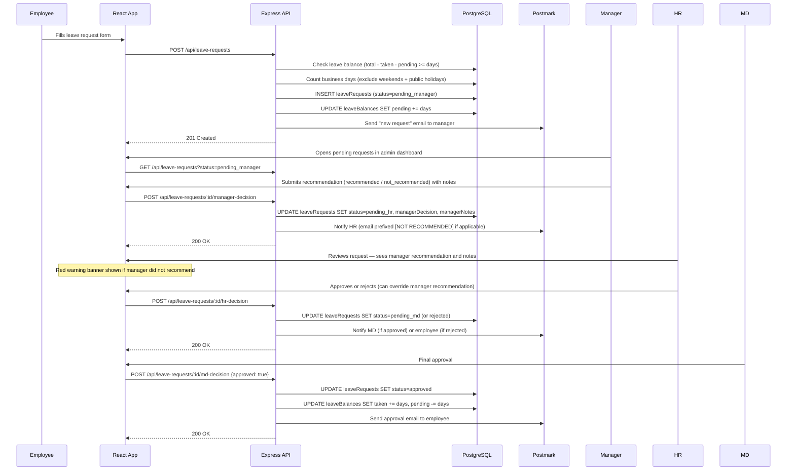
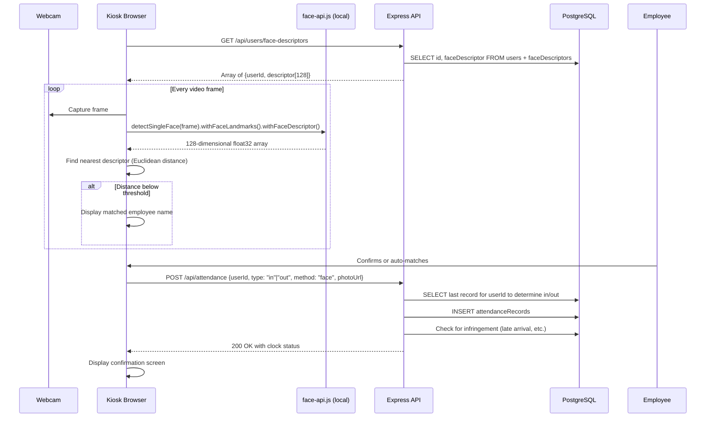
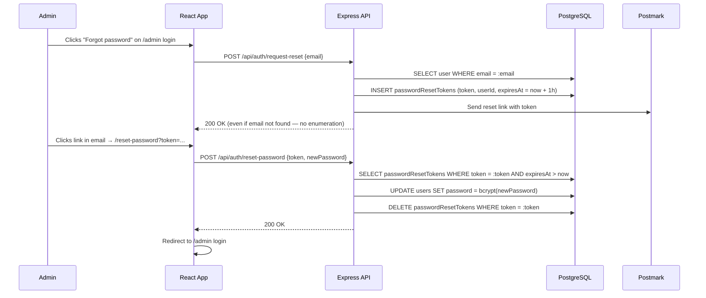
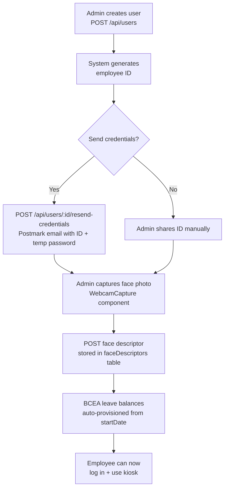

# 06 — Key Workflows

## Overview

This document traces the three most complex end-to-end workflows in the system:
1. Employee submitting and getting a leave request approved
2. Attendance clock-in via the kiosk
3. Face recognition authentication

---

## 1. Leave Request: Submission to Approval

### Actors
- **Employee** (worker)
- **Manager** (recommendation stage)
- **HR Admin** (first decision stage — can override manager recommendation)
- **MD / Director** (final approver)

### Manager recommendation vs. approval

The manager's role is to **recommend**, not to approve or reject. Their decision (`recommended` / `not_recommended`) always forwards the request to HR (or MD if the HR stage is disabled). HR can see the manager's recommendation and notes, and can override a "not recommended" decision. Only HR and MD can finalize a rejection.

### Full sequence



### Balance recalculation on rejection
If HR or MD rejects the request:
```sql
UPDATE leave_balances SET pending = pending - :days WHERE user_id = :userId AND leave_type = :leaveType
```
The balance is fully restored — the employee can resubmit.

---

## 2. Attendance Clock-In (Face Recognition Kiosk)

### Actors
- **Employee** (standing in front of kiosk)
- **Kiosk** (shared device running `/attendance-kiosk`)

### Sequence



### Clock-in vs Clock-out logic
The API determines whether an attendance record is `in` or `out` by checking the employee's most recent record:
- If last record was `out` (or no record exists) → this is a clock-`in`
- If last record was `in` → this is a clock-`out`

The client can override this by explicitly passing `type`.

### Auto clock-out
`POST /api/attendance/auto-reset` (called by a scheduled job or admin manually) inserts a clock-`out` record for any employee who clocked in but has not clocked out by a configured end-of-day time.

---

## 3. Admin Password Reset



---

## 4. New Employee Onboarding

This workflow is admin-driven, not employee-driven.



Leave balances are provisioned by `POST /api/leave-balances/recalculate-sa` or triggered automatically when a user is created with BCEA-applicable settings.

---

## 5. Database Backup and Restore

### Automated backups (Docker)
The `backup` service in `docker-compose.yml` runs on the same network as the database:
```bash
# Runs hourly via cron inside the backup container
pg_dump -h db -U postgres factory_flow > /backups/backup_$(date +%Y%m%d_%H%M%S).sql
# Deletes files older than 7 days
find /backups -name "*.sql" -mtime +7 -delete
```
Backups land on the host at `./data/backups/`.

### Manual JSON backup (Admin UI)
The admin `DatabaseBackupSection` calls a server endpoint that:
1. Queries every table
2. Serialises to a JSON structure
3. Returns as a downloadable file

### Restore
The restore endpoint accepts a JSON backup file and:
1. Iterates each table's records
2. Inserts records that don't already exist (checked by primary key)
3. Never overwrites existing records — purely additive
4. Returns a count summary: `{users: 45, leaveRequests: 312, ...}`
