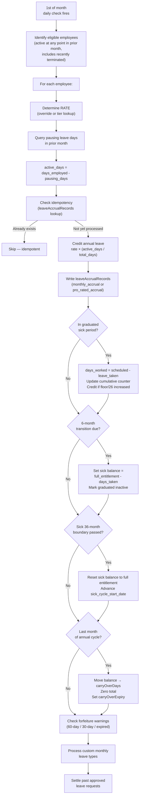
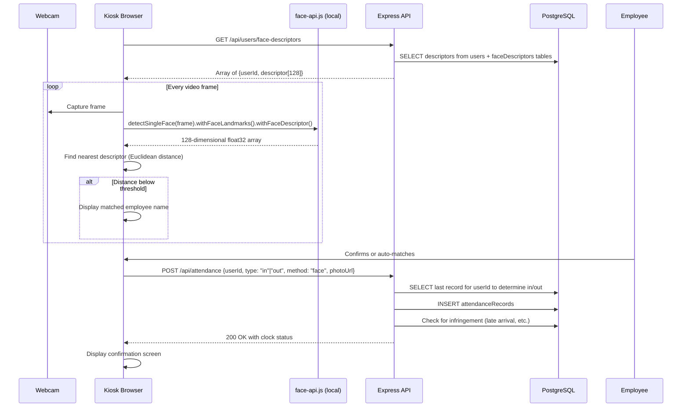
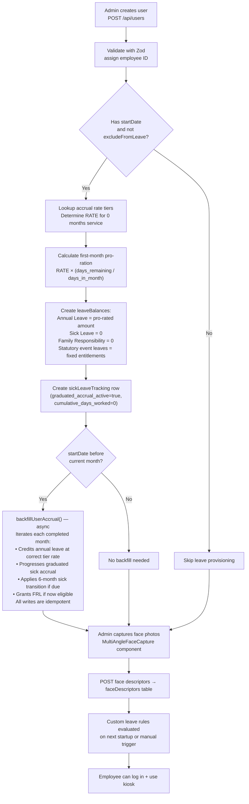
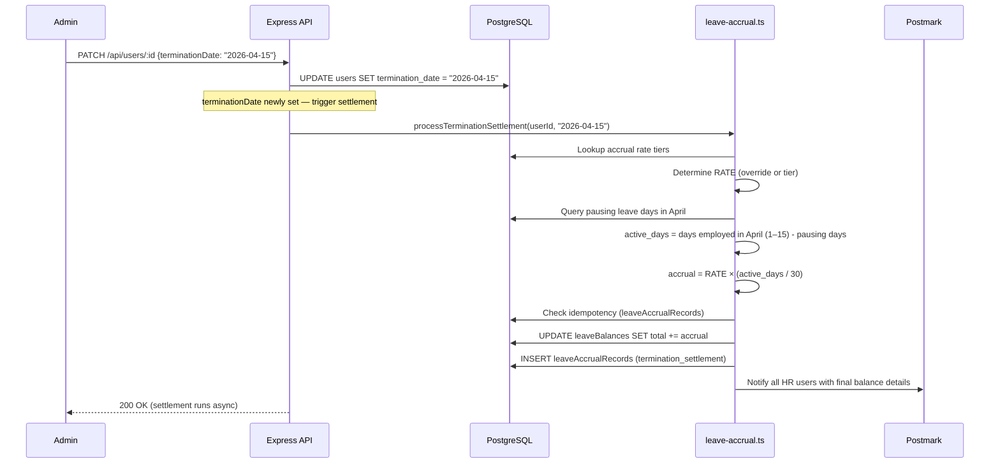

# 06 — Key Workflows

## Overview

This document traces the six most complex end-to-end workflows in the system:
1. Employee submitting and getting a leave request approved
2. Monthly accrual run
3. Attendance clock-in via the kiosk
4. New employee onboarding
5. Employee termination
6. Database backup and restore

---

## 1. Leave Request: Submission to Approval

### Actors
- **Employee** (submission)
- **Manager** (recommendation stage — recommends but does not approve)
- **HR** (first decision stage — can override manager recommendation)
- **MD / Director** (final approver)

### Manager recommendation vs. approval

The manager's role is to **recommend**, not to approve or reject. Their decision (`recommended` / `not_recommended`) always forwards the request to HR (or MD if the HR stage is disabled). HR can see the manager's recommendation and notes, and can override a "not recommended" decision. Only HR and MD can finalize a rejection.

### Full sequence

```mermaid
sequenceDiagram
    participant E as Employee
    participant Client as React App
    participant API as Express API
    participant DB as PostgreSQL
    participant Email as Postmark

    E->>Client: Fills leave request form
    Client->>API: POST /api/leave-requests
    API->>DB: Validate: start ≤ today+12months (else 400)
    API->>DB: Check leave balance (total + carryOver - taken - pending >= days)
    Note over API: Annual Leave shortfall → run projection;<br/>allow with adminNote instead of hard 400
    API->>DB: Count business days (exclude weekends + public holidays)
    API->>DB: INSERT leaveRequests (status=pending_manager)
    API->>DB: UPDATE leaveBalances SET pending += days
    API->>Email: Send "new request" email to manager
    API-->>Client: 201 Created

    Manager->>Client: Opens pending requests in dashboard
    Client->>API: GET /api/leave-requests?status=pending_manager
    Manager->>Client: Submits recommendation with notes
    Client->>API: POST /api/leave-requests/:id/manager-decision
    API->>DB: UPDATE leaveRequests SET status=pending_hr, managerDecision, managerNotes
    API->>Email: Notify HR (prefixed [NOT RECOMMENDED] if applicable)
    API-->>Client: 200 OK

    HR->>Client: Reviews request — sees manager recommendation and notes
    Note over Client: Red warning banner shown if manager did not recommend
    HR->>Client: Approves or rejects
    Client->>API: POST /api/leave-requests/:id/hr-decision
    API->>DB: UPDATE leaveRequests SET status=pending_md (or rejected)
    API->>Email: Notify MD (if approved) or employee (if rejected)
    API-->>Client: 200 OK

    MD->>Client: Final approval
    Client->>API: POST /api/leave-requests/:id/md-decision {decision: "approved"}
    API->>DB: UPDATE leaveRequests SET status=approved, finalizedById, finalizedAt
    API->>DB: UPDATE leaveBalances SET taken += days, pending -= days
    API->>Email: Send approval email to employee
    API-->>Client: 200 OK
```

### Balance recalculation on rejection
```sql
UPDATE leave_balances SET pending = pending - :days WHERE user_id = :userId AND leave_type = :leaveType
```
The balance is fully restored — the employee can resubmit.

---

## 2. Monthly Accrual Run

The accrual engine fires on the **1st of each month** and credits leave earned in the **prior calendar month**.



**Idempotency guarantee:** `writeAccrualRecord()` checks for an existing row in `leaveAccrualRecords` with matching `(employee_id, leave_type, accrual_period, event_type)` before inserting. If a record exists, the event is skipped. Running the engine twice for the same month produces no duplicate credits.

---

## 3. Attendance Clock-In (Face Recognition Kiosk)

### Actors
- **Employee** (standing in front of kiosk)
- **Kiosk** (shared device running `/attendance-kiosk`)

### Sequence



### Clock-in vs Clock-out logic
The API determines whether an attendance record is `in` or `out` by checking the employee's most recent record:
- If last record was `out` (or no record exists) → this is a clock-`in`
- If last record was `in` → this is a clock-`out`

The client can override this by explicitly passing `type`.

---

## 4. New Employee Onboarding

Admin-driven workflow. Leave balances are provisioned immediately on user creation. If `startDate` is in the past, a backdated accrual backfill runs automatically to credit all months already elapsed.



**Backdated employees:** When an employee's `startDate` pre-dates the current month, `backfillUserAccrual()` (in `server/leave-accrual.ts`) iterates every completed month and credits accrual for each. This ensures an employee added months after their actual start date receives the correct balance immediately, without waiting for the monthly run. The backfill uses `writeAccrualRecord()`, so re-running it or overlapping with a regular monthly run produces no duplicates.

**Note on sick leave:** Sick leave starts at 0. During the first 6 months it accrues at 1 day per 26 working days (tracked via the `sickLeaveTracking` row). For backfilled months, the full scheduled working days are used since no actual leave records exist for those periods. FRL starts at 0 until the 4-month eligibility gate is reached.

---

## 5. Employee Termination

When an employee is offboarded, the system immediately calculates a final pro-rated accrual for the partial month.



After termination:
- The employee's `leaveBalances` reflect the final post-settlement balance
- The employee is excluded from future monthly accrual runs (`terminationDate < first_day_of_prior_month`)
- Remaining balance is available for payroll payout calculation (payout itself is out of scope)

---

## 6. Database Backup and Restore

### Automated backups (Docker)
The `backup` service in `docker-compose.yml` runs a continuous loop:
```bash
# Runs every 6 hours (4x/day). Keeps the last 90 days of dumps.
while true; do
  FILENAME=/backups/factoryflow_$(date +%Y%m%d_%H%M%S).sql.gz
  pg_dump -h db -U factoryflow factoryflow | gzip > $FILENAME
  find /backups -name 'factoryflow_*.sql.gz' -mtime +90 -delete
  sleep 21600
done
```
Backups land on the host at `./data/backups/` as gzipped SQL files.

### Manual JSON backup (Admin UI)
The `DatabaseBackupSection` calls `GET /api/backup/export` which:
1. Queries every table
2. Serialises to a JSON structure
3. Returns as a downloadable file

### Admin restore (JSON)
`POST /api/backup/import` accepts a JSON backup file and:
1. Validates the file structure and reports record counts before executing
2. Iterates each table's records
3. Inserts records that don't already exist (checked by primary key)
4. Never overwrites existing records — purely additive
5. Returns a count summary: `{users: 45, leaveRequests: 312, ...}`

Requires an authenticated admin session.

### Bootstrap restore (home page, no login)
For first-time setup on an empty database, the ModeSelect home page (`/`) provides a bootstrap restore modal that:
1. Accepts a JSON backup file
2. Calls `POST /api/backup/bootstrap-validate` to verify the DB is empty and the file is valid
3. If valid, calls `POST /api/backup/import` to load the backup
4. Does not require a login session — only works when the database has no users
